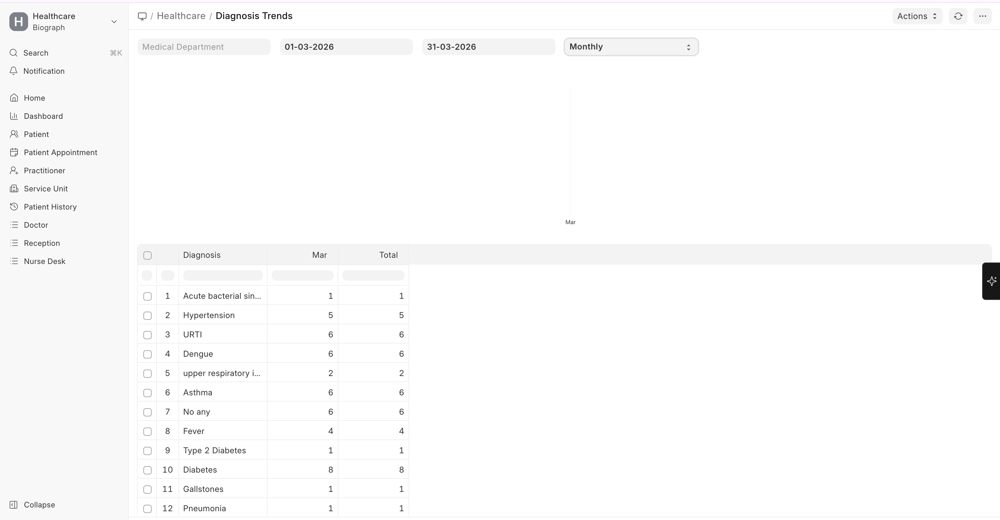
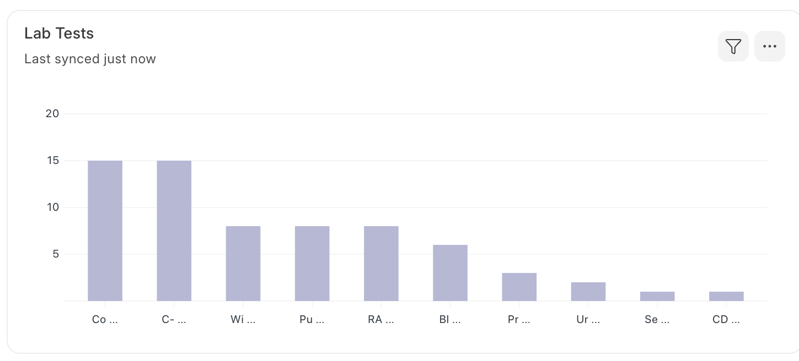
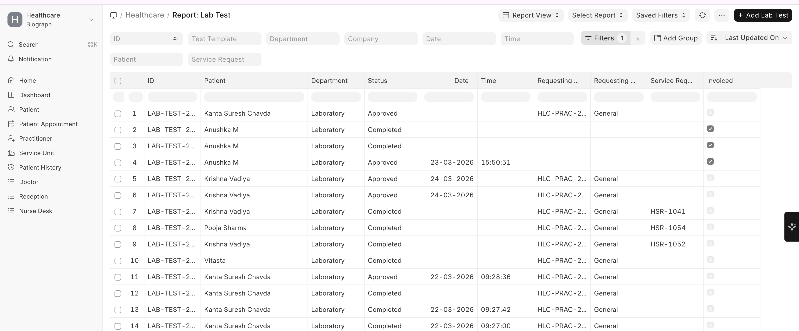
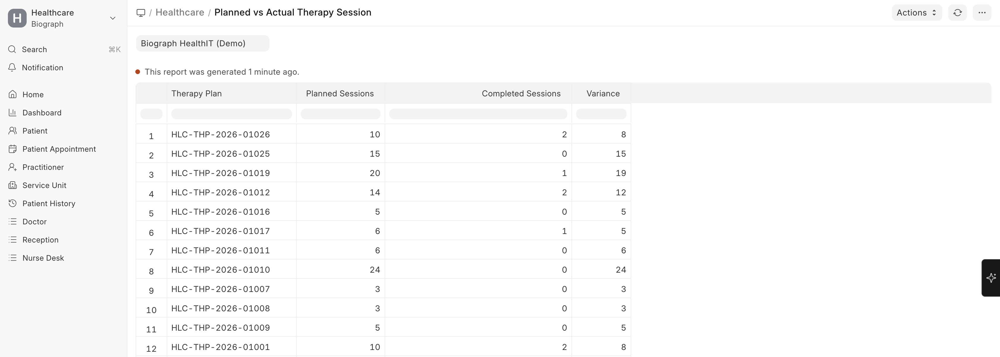

# Clinical Reports

Navigation:

>Home → Build → Reports

## Diagnosis Trends

**What it shows:** Frequency and trends of diagnoses over time.

**Use cases:**
- Identify the most common diagnoses at your facility
- Track seasonal patterns (e.g., respiratory illnesses in winter)
- Support public health reporting requirements
- Inform resource allocation based on disease prevalence

**Filters available:** Date range, Department, Practitioner, Medical Code

## Lab Test Report

**What it shows:** Overview of laboratory test activity.

**Use cases:**
- Track test volumes by type and department
- Monitor turnaround times from order to result
- Identify the most frequently ordered tests
- Support lab capacity planning

**Filters available:** Date range, Lab Test Template, Department, Status

## Planned vs Actual Therapy Sessions

**What it shows:** Comparison between prescribed therapy sessions and actual attendance.

**Use cases:**
- Monitor patient compliance with therapy plans
- Identify patients at risk of dropping out of rehabilitation
- Track therapist utilization
- Measure therapy program effectiveness

**Filters available:** Date range, Therapy Type, Practitioner, Patient

