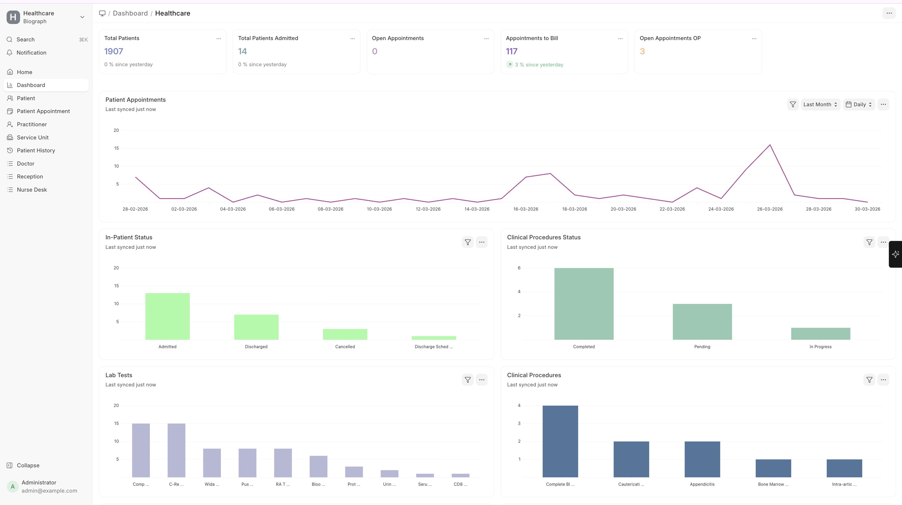
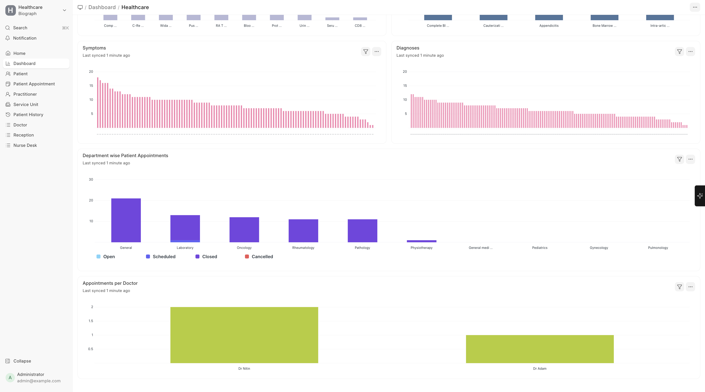

# Dashboards & KPIs

Biograph includes **23 pre-configured KPI cards** and **14 dashboard charts** providing at-a-glance visibility into your facility's operations.

Navigation:

>Home → Dashboard

## Key Performance Indicators (Number Cards)

KPI cards display real-time metrics on your dashboard:

| Category | Example KPIs |
|----------|-------------|
| **Patient Volume** | Total patients, New registrations this month |
| **Appointments** | Today's appointments, Upcoming appointments, Cancellation rate |
| **Clinical** | Encounters today, Pending lab results, Active inpatients |
| **Financial** | Revenue this month, Outstanding receivables, Collection rate |
| **Operations** | Bed occupancy rate, Average length of stay |

## Dashboard Charts

Visual charts for trend analysis:

| Chart Type | What It Shows |
|-----------|--------------|
| **Line charts** | Trends over time (appointments, revenue, patient volume) |
| **Bar charts** | Comparison across categories (department-wise, practitioner-wise) |
| **Pie charts** | Distribution analysis (appointment types, diagnosis categories) |

## Customizing Dashboards

You can customize your dashboard by:
1. Adding or removing number cards
2. Rearranging chart positions
3. Creating custom charts using ERPNext's **Dashboard Chart** builder
4. Setting up department-specific dashboards for different teams

## Building Custom Reports

For reporting needs beyond the built-in options:

1. **Report Builder** — Use ERPNext's query report builder for quick ad-hoc reports
2. **Script Reports** — Create more complex reports with custom logic
3. **Data Export** — Export any list view to CSV/Excel for external analysis
4. **Print Formats** — Design custom report layouts for formal reporting

> **Tip:** Set up **Auto Email Reports** in ERPNext to automatically send key reports to administrators on a daily, weekly, or monthly schedule.

