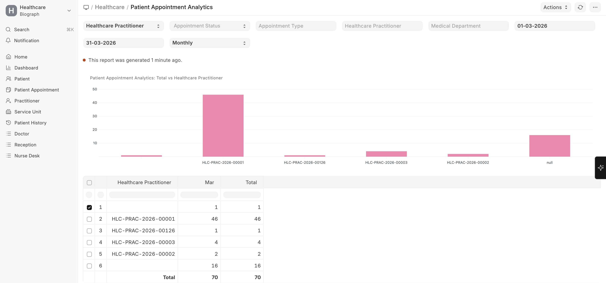
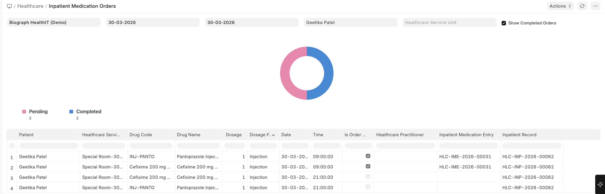
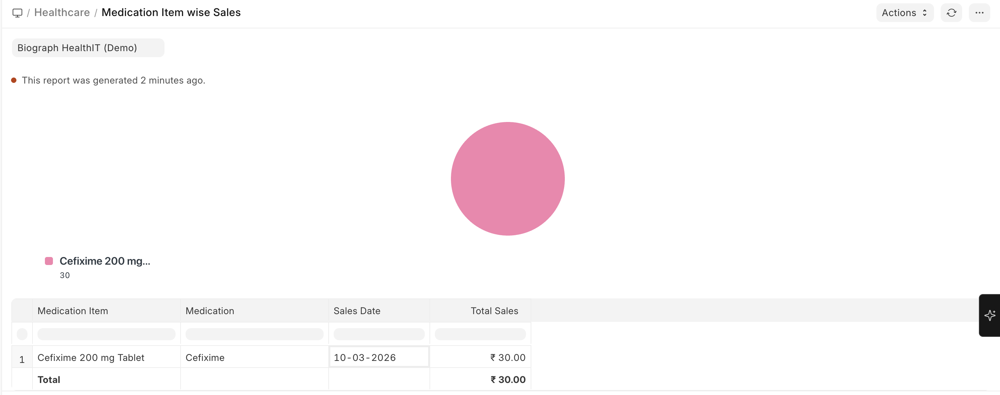

# Operational Reports

Navigation:

>Home → Build → Reports 

## Patient Appointment Analytics

**What it shows:** Comprehensive analysis of appointment patterns.

**Metrics included:**
- Total appointments by status (Scheduled, Completed, Cancelled, No-show)
- Appointment volume by practitioner
- Appointment volume by department
- Peak hours and days
- Average wait times
- Cancellation rates

**Use cases:**
- Optimize practitioner schedules based on demand
- Reduce no-show rates by identifying patterns
- Plan staffing levels based on appointment volumes
- Identify bottlenecks in the appointment process

**Filters available:** Date range, Practitioner, Department, Appointment Type, Status

## Inpatient Medication Orders Report

**What it shows:** Overview of medication ordering patterns for inpatients.

**Use cases:**
- Track medication usage across wards
- Monitor adherence to formulary guidelines
- Support pharmacy stock planning
- Identify prescribing patterns for quality improvement

**Filters available:** Date range, Practitioner, Department, Medication

## Medication Item Wise Sales

**What it shows:** Revenue and volume analysis by medication.

**Use cases:**
- Identify top-selling medications
- Track medication revenue trends
- Support purchasing decisions
- Compare generic vs. branded medication sales

**Filters available:** Date range, Item Group, Item

