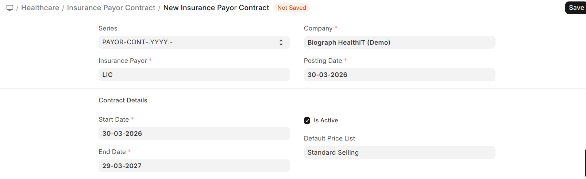

# Insurance Payor Contracts

**Insurance Payor Contracts** define the agreement between your facility and an insurance company, including which services are covered and at what rates.

Navigation:
>Home>Insurance>Insurance>Payor Contract

## Creating a Contract

| Field | Description |
|-------|-------------|
| **Insurance Payor** | The insurance company |
| **Contract Name** | Descriptive name for the agreement |
| **Start Date / End Date** | Contract validity period |
| **Terms** | Contract terms and conditions |
| **Price List** | ERPNext Price List with negotiated rates |

> Contracts help your billing team know exactly what rates to charge for insured patients and which services require pre-authorization.
