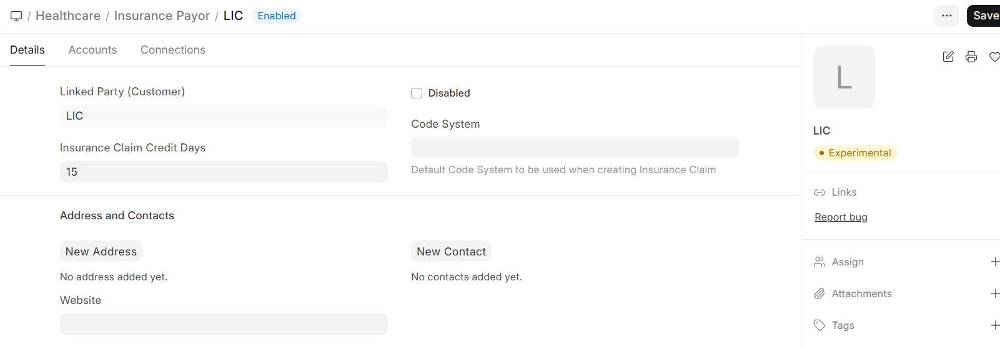

# Insurance Payor Setup

An **Insurance Payor** represents an insurance company or health plan that covers patients' healthcare costs.

Navigation:
>Home>Insurance>Masters>Insurance Payor
## Creating a Payor

1. Go to **Insurance Payor** list
2. Click **+ Add Insurance Payor**
3. Configure:

| Field | Description |
|-------|-------------|
| **Payor Name** | Name of the insurance company |
| **Contact Details** | Phone, email, address |
| **Notes** | Any special processing instructions |

## Common Payors

Set up entries for each insurance company or plan your facility works with:
- National health insurance programs
- Private insurance companies
- Corporate health plans
- Government schemes (CGHS, ECHS, etc.)
