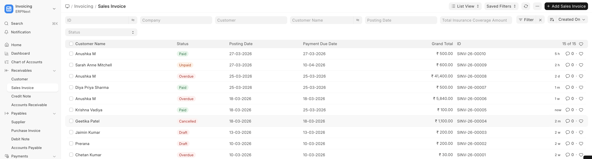

# Invoice Workflow

Sales Invoices follow the standard ERPNext workflow:

```
+----------+      +----------+      +----------+
|  Draft   | ---> |Submitted | ---> |   Paid   |
|          |      |(Unpaid)  |      |          |
+----------+      +----------+      +----------+
      |                 |
      v                 v
+----------+      +----------+
| Cancelled|      | Cancelled|
+----------+      +----------+
```

- **Draft** — Invoice created but not yet finalized
- **Submitted (Unpaid)** — Invoice is finalized and sent to the patient
- **Paid** — Full payment received
- **Partly Paid** — Partial payment received
- **Cancelled** — Invoice voided (e.g., if appointment is cancelled)

> **Healthcare-specific behavior:** When a Sales Invoice linked to a healthcare service is submitted or cancelled, the system automatically updates the billing status of the related clinical records.



