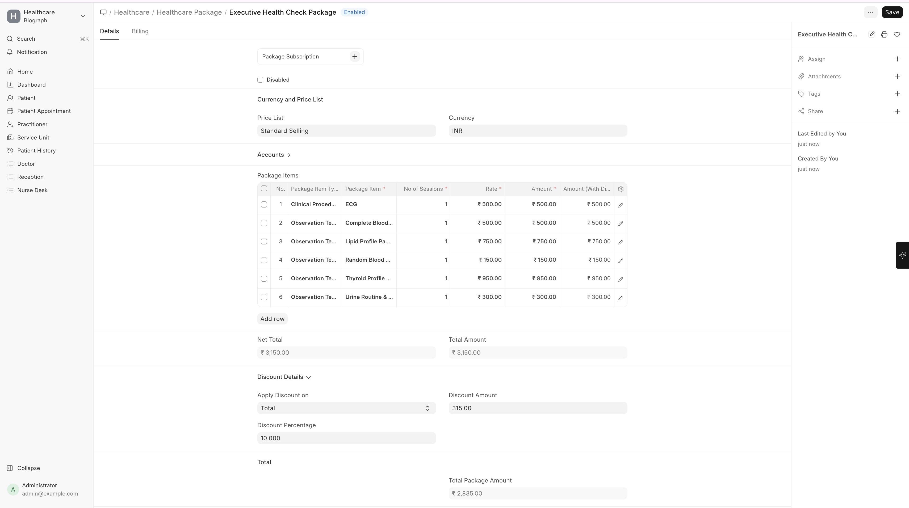
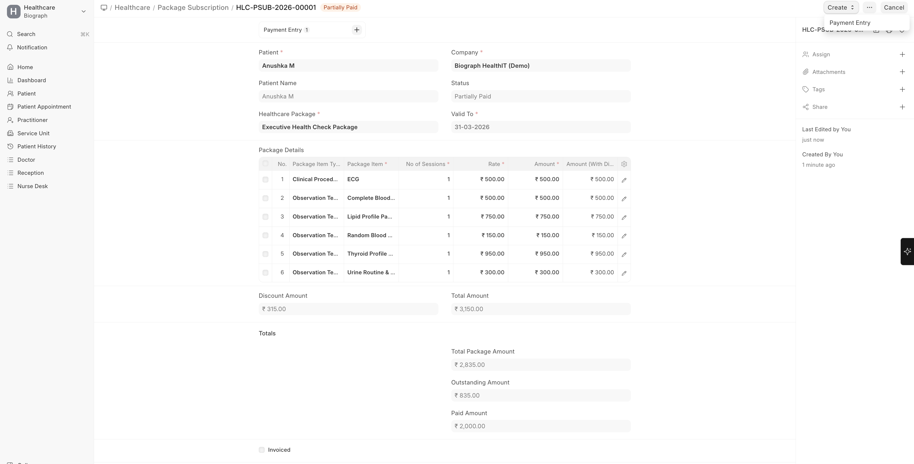
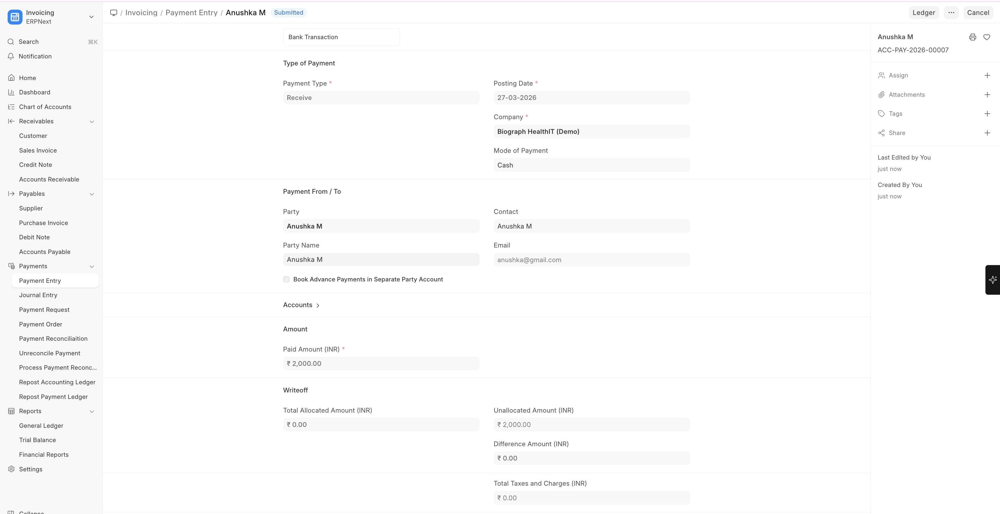

# Package Billing

**Healthcare Packages** bundle multiple services at a fixed price, commonly used for maternity packages, health check-ups, or surgical packages.

To create a Healthcare Package:

>Home → Healthcare → Healthcare Package → New

## Creating a Healthcare Package

1. Go to **Healthcare Package** list
2. Click **+ Add Healthcare Package**
3. Configure:

| Field | Description |
|-------|-------------|
| **Package Name** | e.g., "Executive Health Check", "Maternity Package", "Knee Replacement Package" |
| **Rate** | Total package price |
| **Package Items** | List of included services |

## Package Items

Each item in the package specifies:

| Field | Description |
|-------|-------------|
| **Item** | The service or product included |
| **Quantity** | How many of this item are included |
| **Rate** | Individual item rate (for reference) |

**Example: Executive Health Check Package — Rs. 4,999**

| Included Service | Quantity |
|-----------------|----------|
| Doctor Consultation | 1 |
| Complete Blood Count | 1 |
| Lipid Profile | 1 |
| Blood Sugar (Fasting) | 1 |
| Thyroid Profile | 1 |
| Urine Routine | 1 |
| Chest X-Ray | 1 |
| ECG | 1 |

## Package Subscriptions

Track which patients have subscribed to packages and the utilization status of included services:

| Field | Description |
|-------|-------------|
| **Patient** | The subscribing patient |
| **Package** | The healthcare package |
| **Subscription Date** | When the package was purchased |
| **Utilization** | Which services have been used vs. remaining |

