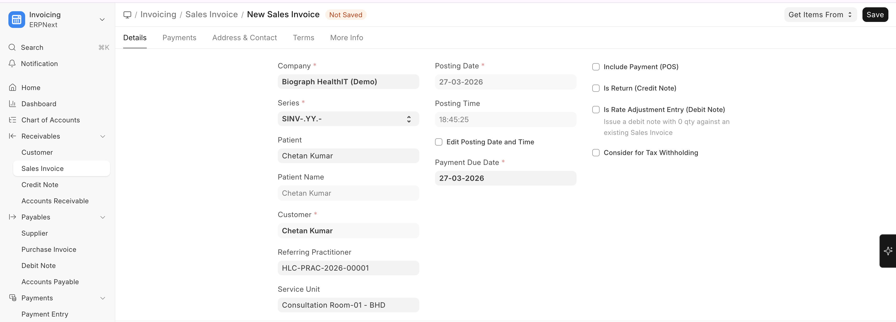
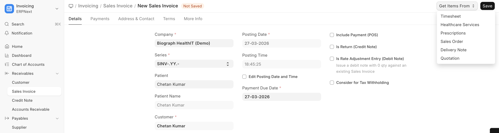
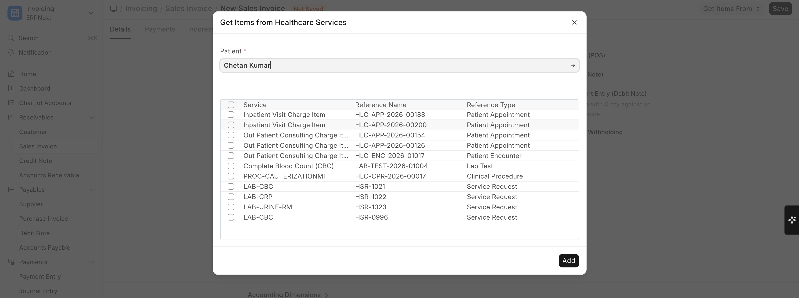

# Patient Billing

## How Billing Works

To create a Patient Invoice:

>Home → Accounts → Sales Invoice → New

Billing in Biograph is handled through ERPNext **Sales Invoices**, enhanced with healthcare-specific fields:

| Healthcare Field | Description |
|-----------------|-------------|
| **Patient** | The patient being billed |
| **Patient Name** | Auto-populated from patient record |
| **Referring Practitioner** | For referral tracking |
| **Service Unit** | Where the service was provided |
| **Total Insurance Coverage** | Amount covered by insurance |
| **Patient Payable Amount** | Amount the patient owes after insurance |

## Invoice Generation

Invoices can be generated:

| Method | When It Happens |
|--------|----------------|
| **Automatic** | When appointment is booked (if auto-invoicing is enabled) |
| **From Encounter** | When clinical orders are placed during consultation |
| **From Procedure** | When a procedure is completed |
| **From Lab Test** | When lab tests are ordered |
| **Manual** | Created directly from Sales Invoice list |

## Invoice Line Items

A typical patient invoice may include:

| Line Item | Source |
|-----------|--------|
| Consultation Fee - Dr. Smith | Appointment / Encounter |
| CBC (Complete Blood Count) | Lab Test Order |
| X-Ray Chest PA View | Clinical Procedure |
| Paracetamol 500mg x 20 | Drug Prescription |
| Ward Bed Charges (3 days) | Inpatient Occupancy |

