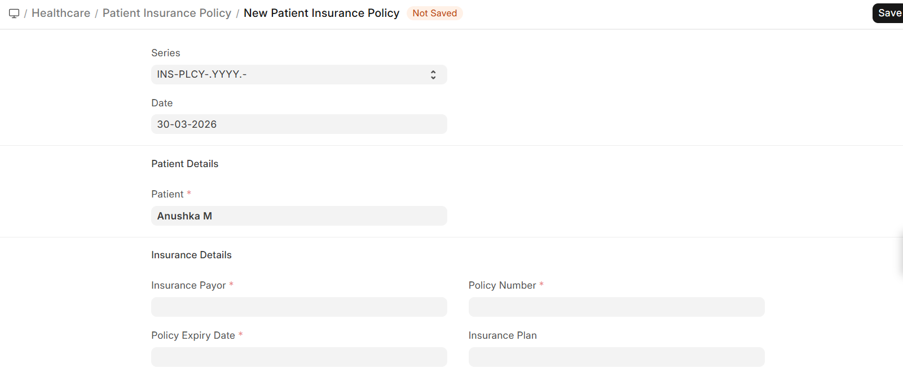

# Patient Insurance Policies

A **Patient Insurance Policy** links a patient to their insurance coverage.

Navigation:

>Home>Insurance>Insurance>Patient Insurance Policy

## Adding Insurance to a Patient

1. Open the **Patient** record
2. Navigate to the Insurance section
3. Add the policy details:

| Field | Description |
|-------|-------------|
| **Insurance Payor** | The insurance company |
| **Policy Number** | The patient's policy/member ID |
| **Plan Name** | Which plan the patient is enrolled in |
| **Valid From / To** | Policy validity dates |
| **Member Name** | Name on the insurance card |
| **Relation** | Self, Spouse, Dependent, etc. |

> A patient can have multiple insurance policies (primary and secondary coverage).
