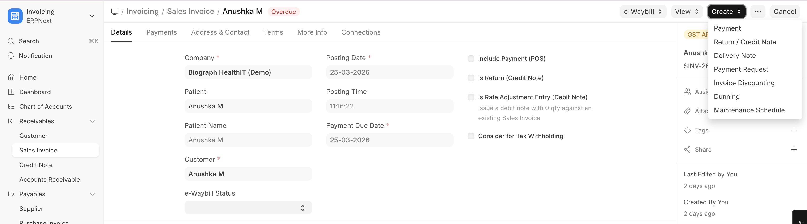
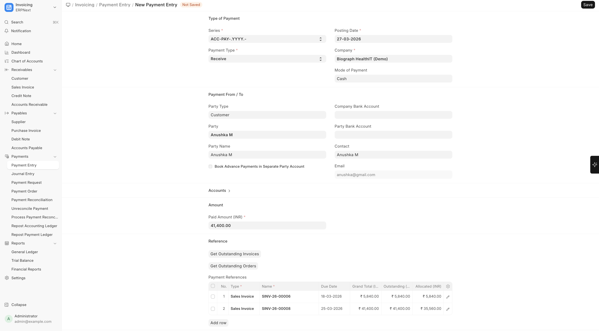
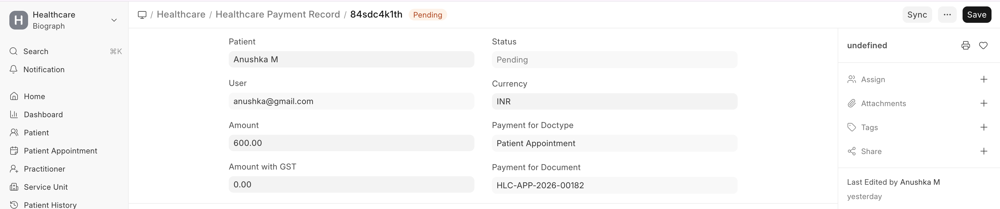

# Payment Processing

Payments are processed through ERPNext's **Payment Entry**.

To record a Payment:

>Home → Accounting → Payment Entry → New  
 (or Sales Invoice → Open Invoice → Create → Payment)

## Recording a Payment

1. From a submitted Sales Invoice, click **Create > Payment Entry**
2. Or create a Payment Entry directly from the Payment Entry list
3. Configure:

| Field | Description |
|-------|-------------|
| **Patient/Customer** | Who is paying |
| **Amount** | Payment amount |
| **Mode of Payment** | Cash, Card, UPI, Bank Transfer, etc. |
| **Reference Number** | Transaction reference |
| **Invoice Reference** | Which invoice(s) this payment covers |

## Healthcare Payment Records

**Healthcare Payment Records** provide a healthcare-focused view of financial transactions, tracking payments across:
- Patient billing
- Insurance settlements
- Package subscriptions
- Advance payments

 

## Payment Integration with Insurance

When insurance is involved:
1. The patient pays their **co-pay** portion
2. The **insurance claim** is processed for the covered amount
3. The insurance payor settles their portion separately
4. Both payments are linked to the original invoice
