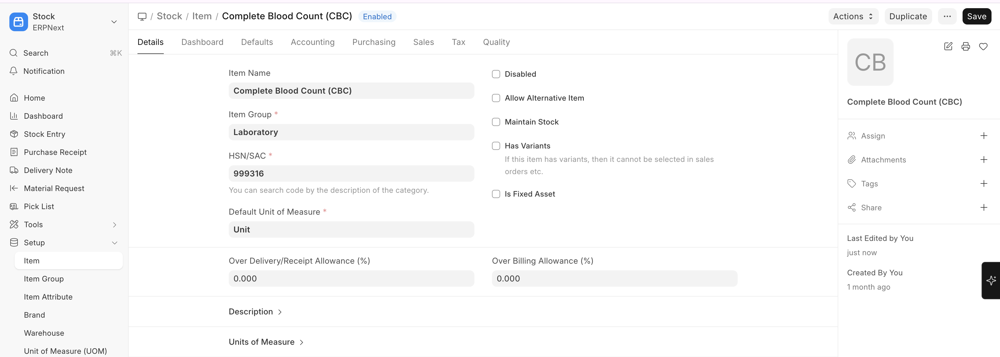

# Service Item Mapping

Every billable healthcare service must be mapped to an **ERPNext Item**. This is how Biograph connects clinical activities to the financial system.

## What Gets Mapped

| Healthcare Service | Mapped To |
|-------------------|-----------|
| **Consultation Fee** | Item linked to Appointment Type or Healthcare Practitioner |
| **Lab Test** | Item linked to Lab Test Template |
| **Clinical Procedure** | Item linked to Clinical Procedure Template |
| **Therapy Session** | Item linked to Therapy Type |
| **Bed Charges** | Item linked to Healthcare Service Unit Type |
| **Medications** | Items in ERPNext Item master (stock items) |
| **Consumables** | Items in ERPNext Item master (stock items) |

To configure Service Item Mapping:

>Home → Stock → Item → New

## Setting Up Service Items

1. Create an **Item** in ERPNext for each healthcare service
2. Set the item as a **Service** type (not a stock item) for non-physical services
3. Configure the **standard rate** (default price)
4. Link the item to the relevant healthcare template (lab test, procedure, etc.)
5. Set up **Item Groups** for organization (e.g., "Consultation Fees", "Lab Charges", "Procedure Charges")

> **Price Lists:** Use ERPNext's price list feature to maintain different rates for different scenarios (e.g., general rate vs. insurance rate vs. discounted rate).

  
