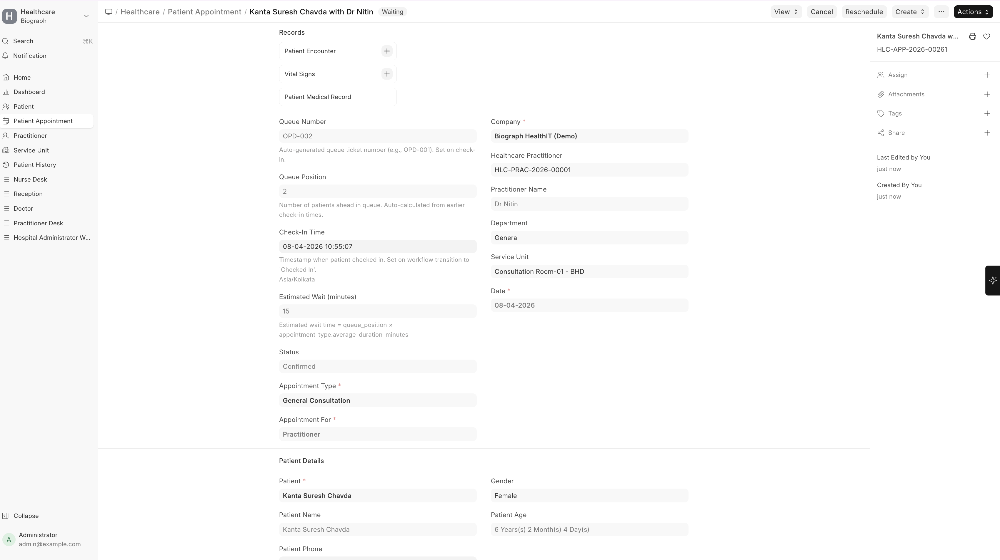
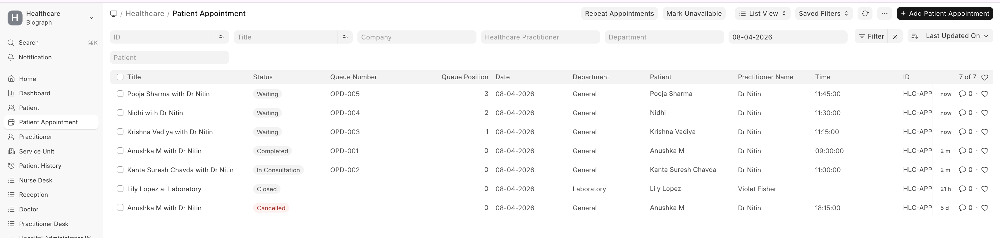
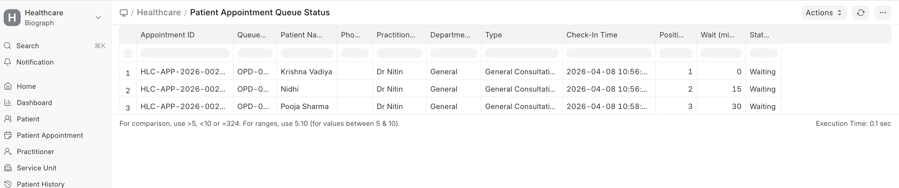
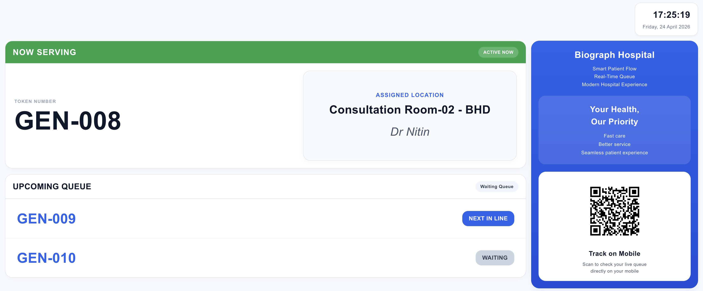
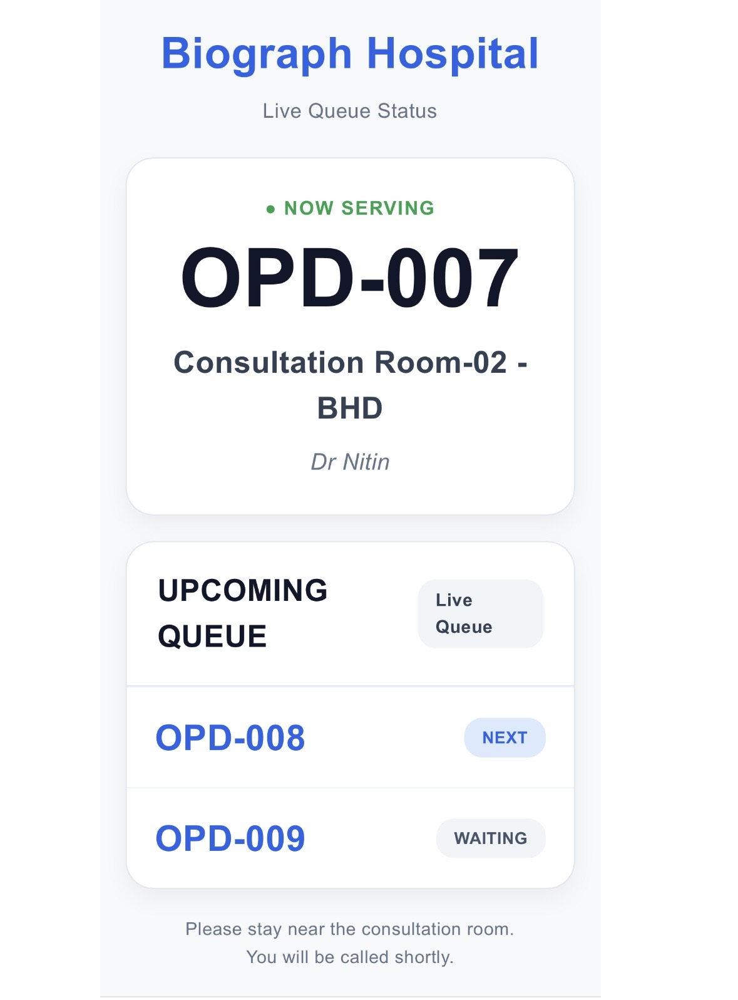

# Patient Appointment Queue Management

Queue Management helps organize patient flow in real time by assigning queue numbers, tracking positions, and estimating wait times.

It ensures a smooth consultation flow and reduces waiting confusion for both patients and staff.

## Where It Works

Queue Management is integrated within:

>Home → Healthcare → Patient Appointment

It becomes active when a patient is **Checked In**.

## How Queue is Generated

When a patient checks in:

- A Queue Number is automatically assigned (e.g., OPD-001)
- The patient is added to the doctor’s queue
- Queue Position is calculated based on check-in time
- Estimated Wait Time is auto-calculated
- Queue is maintained **per practitioner and per date**

## Queue Fields

| Field | Description |
|------|------------|
| Queue Number | Unique token number for the patient (auto-generated) |
| Queue Position | Patient’s position in the queue |
| Check-In Time | Time when patient arrives and is checked in |
| Estimated Wait (minutes) | Calculated wait time based on queue |
| Status | Current appointment status (Waiting, In Consultation, Completed, etc.) |

## Queue Workflow

Patient flow follows this sequence:

>Scheduled → Checked In → Waiting → In Consultation → Completed

### Status Meaning

| Status | Description |
|--------|------------|
| Checked In | Patient has arrived |
| Waiting | Patient is in queue |
| In Consultation | Doctor is currently seeing the patient |
| Completed | Consultation finished |
| Cancelled / No Show | Patient did not attend |

## Queue Calculation Logic

Queue is built based on **Check-In Time (FIFO logic)**  
Earlier check-in = higher priority  

Queue is recalculated automatically whenever there is a change in patient status, such as:

- A patient is moved to consultation  
- An appointment is completed or cancelled  

### Estimated Wait Time

Estimated wait time is calculated as:

**Queue Position × Average Consultation Duration**

Average consultation duration is derived from the **Appointment Type configuration** and updates dynamically as the queue changes.

## Real-Time Queue Updates

The system automatically updates:

- Queue positions  
- Waiting time  
- Next patient  

Whenever:

- A patient status changes  
- A new patient checks in  
- A consultation is completed  

## Next Patient (Reception Dashboard)

Reception dashboard highlights the next patients in queue:

- Shows upcoming patients for each doctor  
- Helps staff call the next patient quickly  
- Provides quick visibility of queue flow
  

## Queue Status View

A dedicated Queue Status View provides:

- Full list of patients in queue  
- Their positions and wait time  
- Practitioner-wise queue tracking  

**Useful for:**

- Reception staff  
- Hospital administrators  
- Monitoring patient flow

## LCD Queue Display

A Smart Digital LCD Display is configured to show live patient queue status in hospital waiting areas.

It helps patients track their turn without asking reception repeatedly and improves visibility of consultation flow.

### Navigation

Users can access the LCD Queue Display through:

> Home → Website → Web Page → Smart Digital Dashboard LCD → See on Website

A dedicated website link is created for the queue display screen, which can be opened directly on TV/LCD screens for live patient queue monitoring.

Patients can also access queue status through:

- QR code scanning from the LCD screen  
- Mobile queue tracking page  
- Dedicated website display link  

### LCD Display Includes

- Now Serving token number  
- Upcoming queue numbers  
- Assigned consultation room  
- Doctor name  
- Live queue status  
- Mobile QR code for queue tracking  
- Multiple doctor LCD display support for shared consultation areas  

### This Supports

- Single consultation room display  
- Two-room split screen display for multiple consultation rooms  
- Multi-doctor LCD display on one screen for multiple active doctors  

### Example Consultation Rooms

- Consultation Room-01 - BHD  
- Consultation Room-02 - BHD  

Patients can easily identify where to go when their token is called.

## Mobile Queue Tracking

Patients can scan the QR code shown on the LCD screen to check their live queue status directly on mobile.

A dedicated mobile-friendly queue page is configured to display real-time queue updates, including:

- Current token being served  
- Upcoming queue numbers  
- Doctor name  
- Consultation room details  

This helps patients:

- Wait comfortably nearby  
- Avoid standing near the reception desk  
- Track upcoming queue in real time  
- Easily identify their consultation room and doctor  

This improves patient experience, reduces crowding in waiting areas, and provides better visibility of patient flow.

## Key Benefits

- Reduces patient waiting confusion  
- Improves doctor workflow  
- Enables real-time tracking  
- Enhances patient experience  
- Supports operational efficiency  

## Important Notes

- Queue starts only after **Check-In**  
- Cancelled or completed patients are removed from queue  
- Queue is maintained per practitioner  
- Multiple practitioners maintain separate queues  
