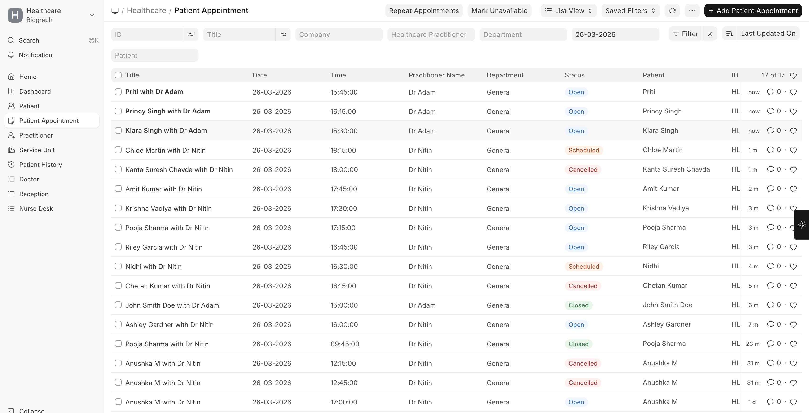

# Appointment Status Workflow

Patient Appointments follow a defined status workflow:

```
┌──────────┐      ┌──────────┐      ┌──────────┐      ┌──────────┐
│   Open   │ ───► │ Scheduled│ ───► │ Checked  │ ───► │  Closed  │
│          │      │          │      │   In     │      │          │
└──────────┘      └──────────┘      └──────────┘      └──────────┘
                        │                                    ▲
                        │           ┌──────────┐            │
                        └─────────► │Cancelled │            │
                                    └──────────┘            │
                                                           │
                              Patient Encounter ───────────┘
                              created and submitted
```

| Status | Description |
|--------|-------------|
| **Open** | Appointment created, awaiting scheduling |
| **Scheduled** | Confirmed and scheduled for a specific date/time |
| **Checked In** | Patient has arrived at the facility |
| **Closed** | Consultation completed (usually after encounter is submitted) |
| **Cancelled** | Appointment was cancelled |

  

> The system automatically updates expired open appointments to **Cancelled** status via a daily scheduled task.
