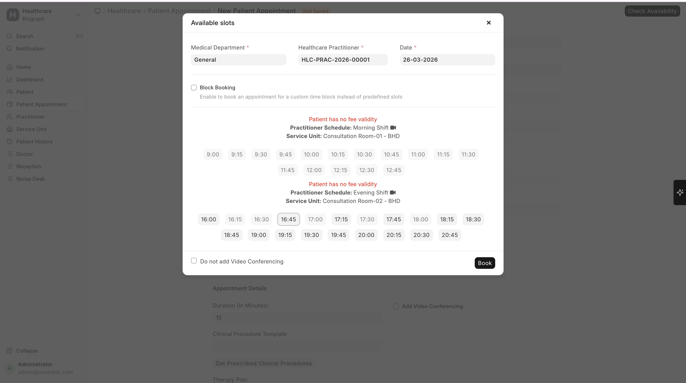
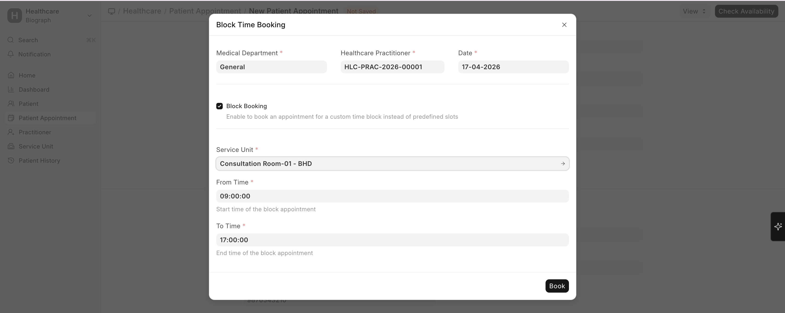
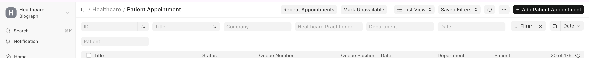
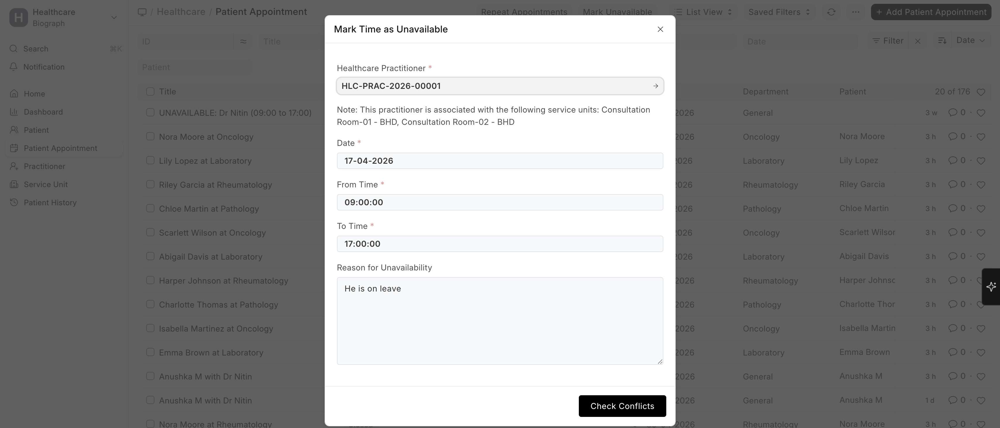

# Creating a Patient Appointment

To create a Patient Appointment, go to:

>Home → Healthcare → Patient Appointment

## From the Appointment List

1. Go to **Patient Appointment** list
2. Click **+ Add Patient Appointment**
3. Fill in the details:

| Field | Description |
|-------|-------------|
| **Patient** | Select the patient (auto-populates patient name) |
| **Appointment Type** | Choose the type (General, Follow-up, Specialist, etc.) |
| **Practitioner** | Select the doctor/practitioner |
| **Department** | Medical department (auto-filled from practitioner) |
| **Service Unit** | Specific room or location (optional) |
| **Appointment Date** | Select the date |
| **Appointment Time** | Choose from available time slots |
| **Duration** | Auto-filled from appointment type, can be overridden |
| **Referring Practitioner** | If the patient was referred by another doctor |
| **Notes** | Any additional notes for the appointment |

## Available Time Slots

 

When you select a practitioner and date, the system shows **available time slots** based on:
1. The practitioner's **schedule template** for that day of the week
2. Any **availability overrides** for that specific date
3. Time slots already booked by other patients are excluded
4. Buffer time between appointments (if configured)

## Block-Based Appointment Booking

Block-based appointment booking allows scheduling appointments for a **custom time range** instead of selecting predefined time slots. This is useful for longer consultations, therapy sessions, or procedures.

### To Create a Block-Based Appointment

Go to:

> Home → Healthcare → Patient Appointment

#### From the Appointment Form

1. Click **+ Add Patient Appointment**
2. Fill basic details (Patient, Practitioner, Date, etc.)
3. Click **Check Availability**
4. In the availability dialog:
   - Enable **Block Booking**
   - Select required details

### Block Booking Fields

| Field | Description |
|-------|-------------|
| **Medical Department** | Department linked to the practitioner |
| **Healthcare Practitioner** | Selected doctor/practitioner |
| **Date** | Appointment date |
| **Service Unit** | Room or location for appointment |
| **From Time** | Start time of the appointment |
| **To Time** | End time of the appointment |

### How It Works

- Instead of predefined slots, users manually enter **From Time** and **To Time**
- The system automatically:
  - Calculates the appointment duration
  - Books the entire time block

**Suitable for:**
- Therapy sessions  
- Long consultations  
- Procedures  

### Validation Rules

The system ensures:
- **From Time** must be earlier than **To Time**
- Cannot book past date/time
- No overlapping appointments are allowed

### Conflict Detection

Before booking:
- The system checks for:
  - Existing appointments
  - Previously marked unavailable slots

If conflict exists:
- Booking is blocked
- A **detailed conflict dialog** is shown listing overlapping appointments

### Outcome

- A standard **Patient Appointment** is created
- Duration is based on selected time range
- Appears in:
  - Appointment List
  - Calendar View
- A corresponding **calendar event** is created for the booked time block

---

## Mark Time as Unavailable

The **Mark Unavailable** feature allows blocking a practitioner’s schedule for a specific time range. This prevents any appointments from being booked during that period.

### To Mark Time as Unavailable

Go to:

> Home → Healthcare → Patient Appointment

#### From the Appointment List

1. Click **Mark Unavailable**
2. Fill the required details
3. Click **Check Conflicts**
4. Save the record

### Unavailability Fields

| Field | Description |
|-------|-------------|
| **Healthcare Practitioner** | Practitioner whose schedule is blocked |
| **Date** | Date of unavailability |
| **From Time** | Start time of unavailability |
| **To Time** | End time of unavailability |
| **Reason for Unavailability** | Optional reason (e.g., Leave, Emergency) |

### How It Works

- Blocks selected time range for the practitioner
- Can also be applied to a **Service Unit**, not just a practitioner

Prevents:
- New bookings  
- Slot visibility during appointment creation  

Applies across all associated service units.

### Conflict Detection

Before saving:
- System checks for existing appointments in the same time range

If conflicts are found:
- Displays a **detailed conflict dialog** with overlapping appointments
- Prevents saving until resolved

### System Behavior

Creates a special **Patient Appointment** with:
- **Appointment Type:** Unavailable  
- **Status:** Unavailable  

This record:
- Blocks scheduling  
- Appears in list and calendar  

### Visual Indicators

Unavailable slots are:
- Highlighted in **red (#ff5858)** in Calendar View  
- Marked clearly in Appointment List  

### Cancellation of Unavailability

To remove blocked time:

1. Open the Unavailable record  
2. Click **Cancel**

System will:
- Remove the block  
- Restore availability  
- Remove the associated calendar event  

---

## Key Notes

- Both features use the same **conflict detection mechanism**
- **Block Booking** → Creates normal appointments with custom time  
- **Mark Unavailable** → Creates system-blocking entries  
- Overlapping bookings are strictly prevented  
- Both features are fully integrated with the calendar for real-time visibility  
