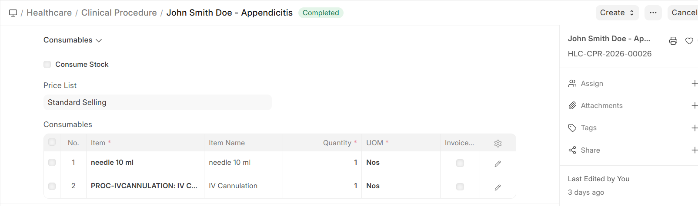

# Procedure Consumables & Billing

## Consumables Management

Tracking consumables used during procedures is essential for:
- **Accurate billing** — Charge patients for materials used
- **Inventory management** — Maintain adequate stock levels
- **Cost analysis** — Understand the true cost of each procedure

### How Consumables Work

1. **Template defines defaults** — The procedure template lists standard consumables
2. **Adjust at procedure time** — The practitioner can add or remove items based on actual usage
3. **Stock integration** — When ERPNext Stock module is configured, consumables are automatically deducted from the service unit's warehouse
4. **Billing integration** — Consumable costs can be added to the patient's invoice

## Procedure Billing

Procedures are billed through the ERPNext invoicing system:

| Billing Component | Source |
|-------------------|--------|
| **Procedure charge** | From the procedure template's linked Item and Rate |
| **Consumables** | Individual item charges from the consumables list |
| **Practitioner fee** | If the performing practitioner has separate charges |

### Billing Flow

1. Procedure is **ordered** from a Patient Encounter → Invoice line item can be created
2. Procedure is **completed** and submitted → Consumables are finalized
3. **Sales Invoice** includes the procedure charge and consumable costs
4. Payment is processed through ERPNext Payment Entry

> **Tip:** For procedures ordered from an encounter, the billing can be automated — the system creates the invoice item when the procedure order is placed, not when the procedure is performed.
