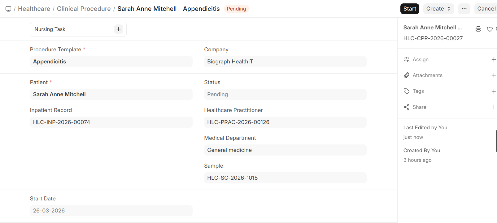

# Clinical Procedure Creation

A **Clinical Procedure** represents any medical procedure performed on a patient — from minor procedures like ECGs and wound dressings to more complex interventions.

## Creating a Clinical Procedure

Clinical procedures can be created from:
- **Patient Encounter** — When a practitioner orders a procedure during consultation

>Home>Healthcare>Consultation>Patient Encounter>Patient>Create
  
- **Procedure List** — Directly from the Clinical Procedure list for standalone procedures

  >Home>Healthcare>Consultation>Clinical Procedure

| Field | Description |
|-------|-------------|
| **Patient** | Select the patient |
| **Procedure Template** | Choose from pre-configured templates |
| **Practitioner** | The practitioner performing the procedure |
| **Service Unit** | Where the procedure will be performed |
| **Start Date/Time** | Scheduled time |
| **Prescription** | Link to the originating encounter prescription (if any) |
| **Notes** | Pre-procedure instructions or observations |

