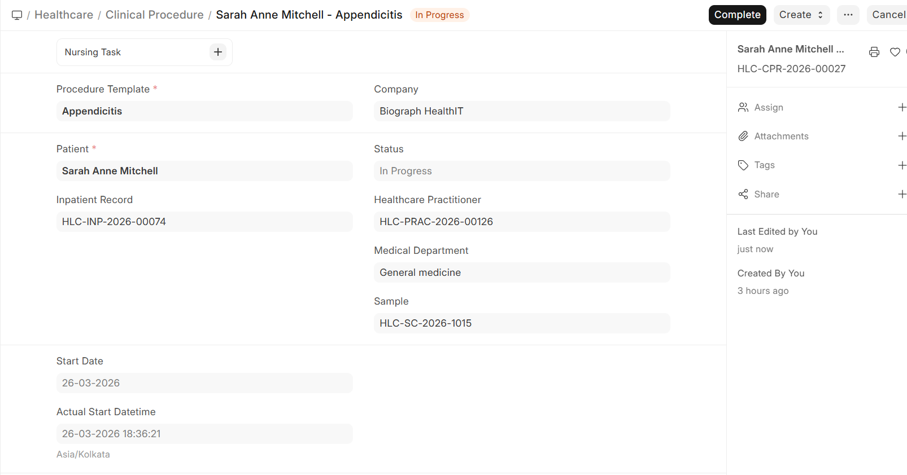
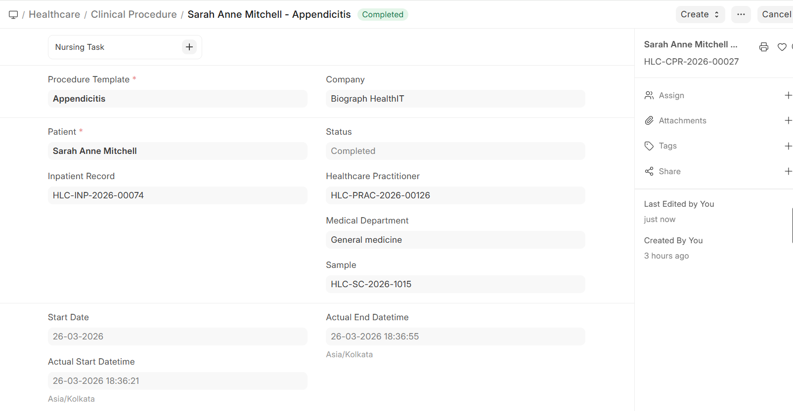

# Procedure Workflow

Clinical procedures follow a structured workflow:

## Start Procedure

1. Open the **Clinical Procedure** record
2. Verify patient details and procedure information
3. Record any **pre-procedure checks** or observations
4. Click **Start** to mark the procedure as in progress
5. Document:
   - Actual start time
   - Practitioner performing the procedure
   - Any deviations from the template



## Complete Procedure

1. After the procedure is finished, click **Complete**
2. Document:
   - **Completion time**
   - **Procedure notes** — Findings, observations, complications (if any)
   - **Post-procedure instructions** for the patient
   - **Consumables used** — Verify or adjust the items consumed
3. **Submit** the record to finalize it



## Status Flow

```
┌──────────┐      ┌──────────┐      ┌──────────┐      ┌──────────┐
│  Draft   │ ───► │  Start   │ ───► │ Complete │ ───► │Submitted │
│          │      │          │      │          │      │          │
└──────────┘      └──────────┘      └──────────┘      └──────────┘
      │                                                       │
      ▼                                                       ▼
┌──────────┐                                          ┌──────────┐
│Cancelled │                                          │ Cancelled│
└──────────┘                                          └──────────┘
```
