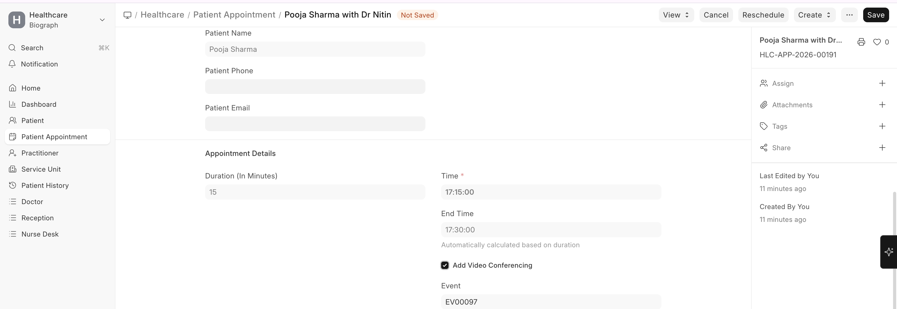

# Teleconsultation Integration

Biograph supports teleconsultation workflows:

- **Virtual appointments** can be marked as teleconsultations
- **Video call links** can be added to the appointment record
- Patients receive the consultation link via notification
- The clinical documentation workflow (encounter, prescriptions) remains the same as in-person visits
- Billing for teleconsultations follows the same rules as regular appointments

 
