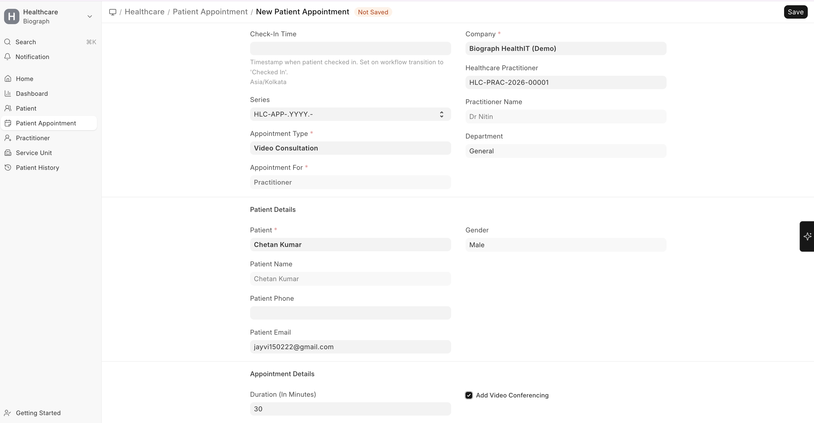
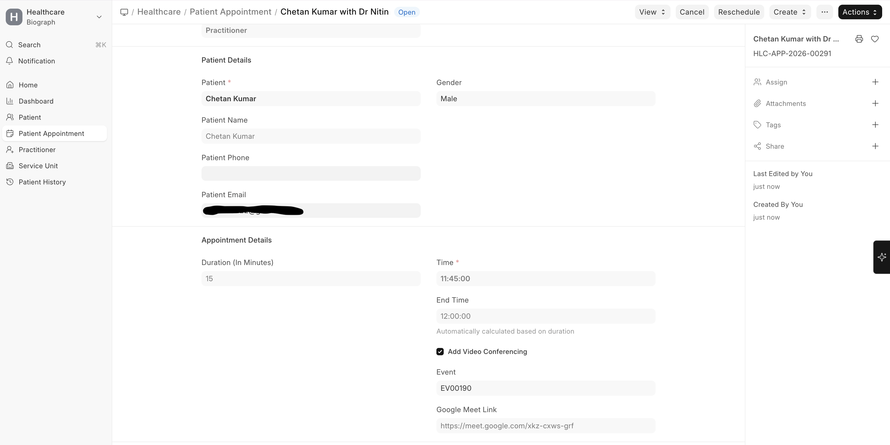
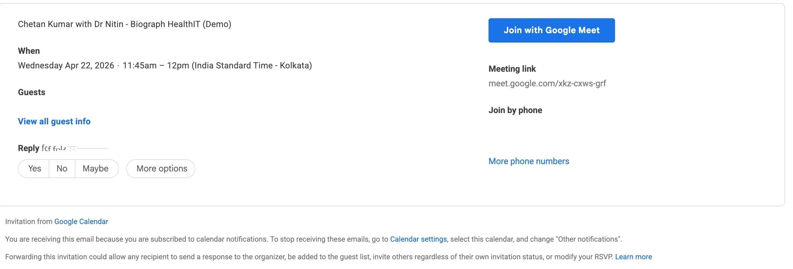
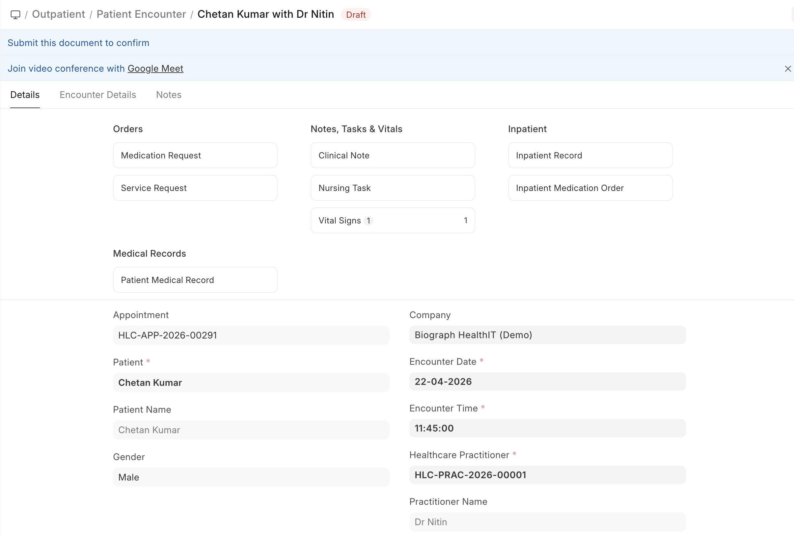
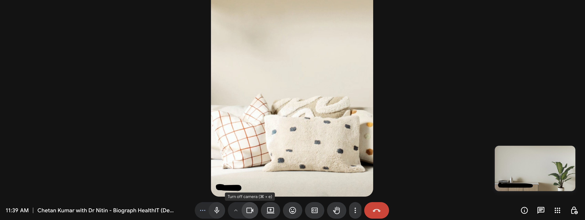

# Teleconsultation Integration

Biograph supports teleconsultation workflows, enabling practitioners to conduct remote consultations using video conferencing.

Teleconsultation is implemented as an extension of the **Patient Appointment** workflow, where appointments can be enabled for video consultation.

## Overview

Teleconsultation in Biograph works by integrating with **Google Meet via Google Calendar**.

When a teleconsultation appointment is created:

- A Google Calendar event is generated  
- A Google Meet link is created  
- The link is attached to the appointment  
- The patient receives the meeting link via email  

The clinical workflow (encounter, prescriptions, and billing) remains the same as in-person consultations.

## Teleconsultation Setup (Prerequisite)

Before using teleconsultation, Google integration must be configured.

### Required Configuration

- Google Cloud Project creation  
- Google Calendar API enabled  
- OAuth Consent Screen configured  
- OAuth Client ID & Secret generated  
- Credentials added in Google Settings  
- Google account authorization completed  

> Without this setup, video conferencing links cannot be generated.

## Creating a Teleconsultation Appointment

Navigate to:

>Home → Healthcare → Patient Appointment

### Steps

1. Go to **Patient Appointment**  
2. Click **+ Add Patient Appointment**  
3. Fill in required details:
   - Patient  
   - Practitioner  
   - Appointment Type  
   - Date & Time  
4. Enable:
   - **Add Video Conferencing**  
5. Save the appointment  

>The standard appointment creation flow remains the same.

## What Happens on Save

When **Add Video Conferencing** is enabled:

- A Google Calendar event is created  
- A Google Meet link is generated  
- The link is stored in the `google_meet_link` field in the appointment  
- The patient receives an email notification with the meeting link  

## End-to-End Teleconsultation Flow

### Step 1: Appointment Booking

- Appointment is created with **Add Video Conferencing enabled**  
- System generates the meeting link  

### Step 2: Notification

**Practitioner receives:**
- Calendar event (if configured)

**Patient receives:**
- Email with Google Meet link

### Step 3: Consultation Preparation

- Appointment appears in the system  
- Encounter can be created from the appointment  

### Step 4: Joining Consultation

#### Practitioner

- Opens **Patient Encounter**  
- Clicks **“Join video conference with Google Meet”**

#### Patient

- Joins using:
  - Email link  
  - Google Calendar invite
 

### Step 5: Consultation Execution

- Consultation takes place on **Google Meet (external)**  
- Clinical data is recorded in **Patient Encounter**  

### Step 6: Post Consultation

Doctor records:

- Diagnosis  
- Prescription  
- Notes  

Billing follows the **standard appointment workflow**.

## System Components Involved

| Component               | Role                         |
|------------------------|------------------------------|
| Patient Appointment    | Booking teleconsultation     |
| Add Video Conferencing | Enables teleconsultation     |
| Google Calendar        | Event creation               |
| Google Meet            | Video consultation           |
| Patient Encounter      | Consultation documentation   |

## Key Notes

- Teleconsultation is **not a separate module**  
- It is built on top of the **existing appointment workflow**  
- Video consultation is conducted via **Google Meet**  
- Clinical and billing workflows remain unchanged  

## Summary

Biograph supports teleconsultation using Google Meet via Google Calendar integration, where video consultation links are generated during appointment booking.

The consultation itself is conducted externally, while all clinical and billing workflows are managed within the system.
