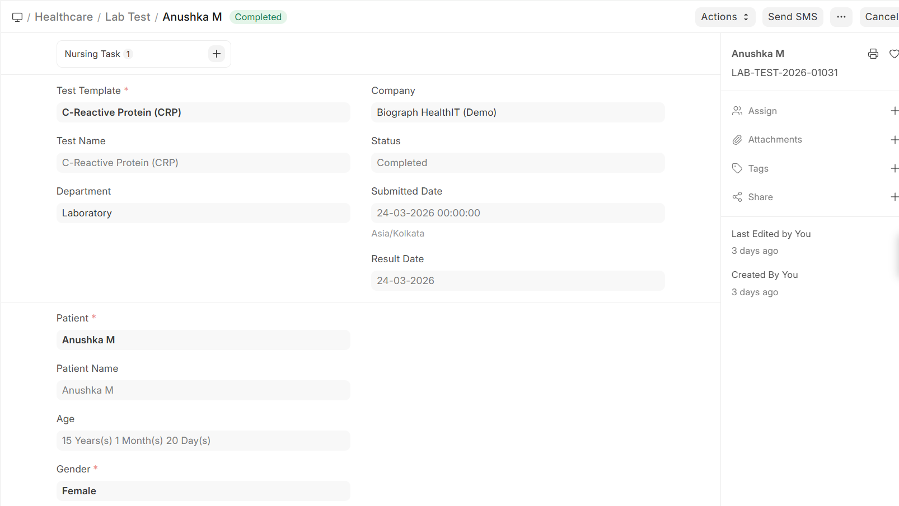

# Lab Test Creation

Lab tests can be created through several pathways:

## From a Patient Encounter
1. Practitioner adds a lab order in the encounter's **Lab Prescription** section
2. On encounter submission, the lab test is **automatically created** (if configured)
3. The lab test appears in the Lab Test list, linked to the encounter

## Standalone
1. Go to **Lab Test** list
2. Click **+ Add Lab Test**
3. Select the patient and test template
4. Submit when ready to begin processing

## Lab Test Record

| Field | Description |
|-------|-------------|
| **Patient** | The patient being tested |
| **Lab Test Template** | The type of test |
| **Requesting Practitioner** | Who ordered the test |
| **Lab Technician** | Who processes the test |
| **Sample** | Link to the sample collection record |
| **Status** | Draft → Submitted → Completed / Cancelled |

