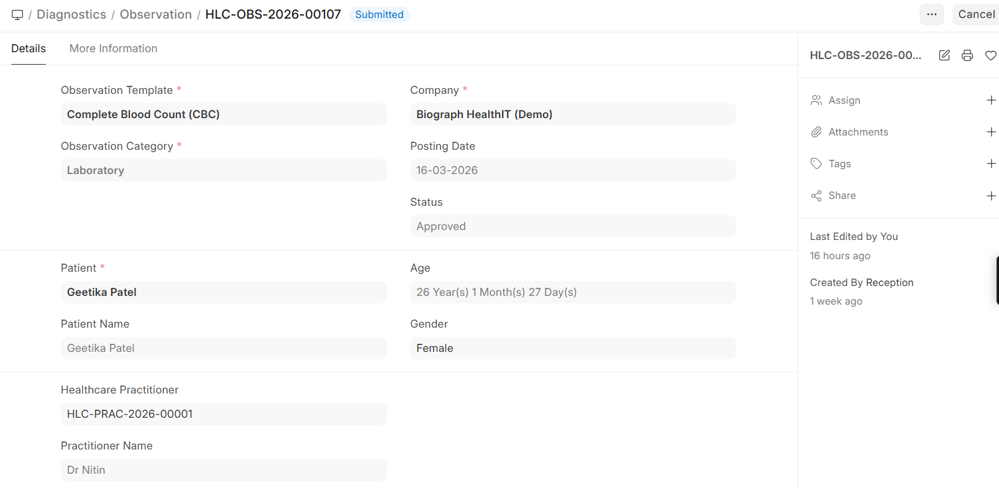
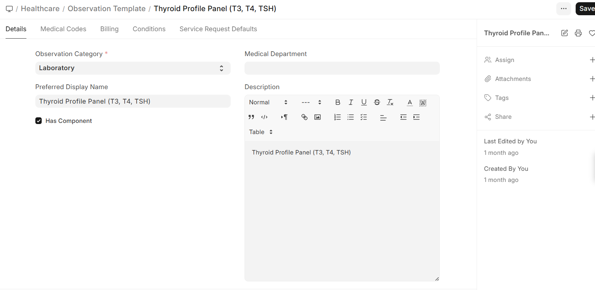

# Observations & Results

## Observation Management

**Observations** are the individual measurements or findings within a lab test, following **FHIR (Fast Healthcare Interoperability Resources)** standards.

Navigation:

>Home>Diagnostics>Diagnostics>Observation

>Home>Healthcare>Diagnostic Module>Observation

### How Observations Work

Each lab test can have multiple observations:

| Observation Field | Description |
|------------------|-------------|
| **Observation Template** | Links to the pre-configured template |
| **Result Value** | The measured value |
| **Unit** | Unit of measurement (g/dL, mmol/L, /μL, etc.) |
| **Reference Range** | Normal range for comparison |
| **Interpretation** | Normal, Abnormal, Critical |
| **Notes** | Additional comments from the lab |

### Observation Templates

Pre-configure observation templates with:
- **Reference ranges** — Different ranges by age and gender
- **Units of measurement** — Standard lab units
- **Permitted values** — For qualitative results (Positive/Negative, Reactive/Non-Reactive)
- **Critical ranges** — Values that trigger alerts

### Reference Ranges

Reference ranges can be configured by:
| Criteria | Example |
|----------|---------|
| **Gender** | Hemoglobin: Male 13-17 g/dL, Female 12-16 g/dL |
| **Age** | Hemoglobin: Child 11-14 g/dL, Adult 13-17 g/dL |

## Result Entry & Formats

### Normal Results

For quantitative tests with numeric values:
1. Open the lab test record
2. Enter the numeric result for each parameter
3. The system automatically flags values outside reference ranges
4. Submit the results for approval

### Descriptive Results

For qualitative tests:
1. Enter text-based findings (e.g., Appearance, Color, Consistency)
2. Select from pre-defined options where available
3. Add free-text notes for detailed descriptions

### Organism Results (Microbiology)

For culture and sensitivity tests:
1. Record the **organism** identified (e.g., E. coli, Staphylococcus aureus)
2. Enter **sensitivity results** for each antibiotic tested:
   - **Sensitive (S)** — The organism responds to this antibiotic
   - **Resistant (R)** — The organism does not respond
   - **Intermediate (I)** — Partial response
3. Record the **colony count** if applicable
