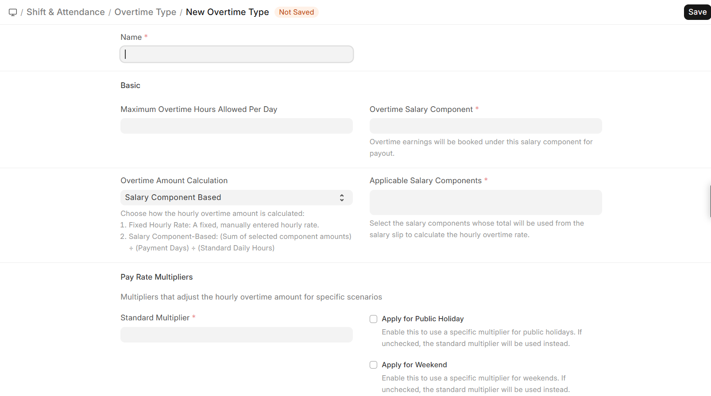
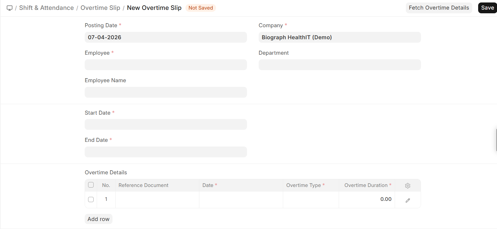

# Overtime Management

Overtime Management defines how extra working hours are calculated and processed for employees, ensuring accurate compensation through payroll.

## Navigation
>Home>HR>Shift & Attendance>Overtime

## Overtime Type

Overtime Type defines the rules used to calculate overtime and determine payout.

### Key Fields

| Field                        | Description                                      |
|------------------------------|--------------------------------------------------|
| Name                         | Identifier for the overtime rule                 |
| Maximum Overtime Hours       | Daily overtime limit                             |
| Overtime Salary Component    | Salary component used for payout                 |
| Calculation Method           | Fixed Hourly Rate or Salary Component Based      |
| Applicable Salary Components | Used when calculation is component-based         |
| Standard Multiplier          | Base multiplier for overtime pay                 |

### Multipliers

- **Standard Multiplier** — Applied on regular days  
- **Weekend / Holiday Multipliers** — Applied when enabled  

## Overtime Slip

Overtime Slip records and processes overtime for a defined period and converts it into payable earnings.

- Used to fetch overtime from attendance  
- Generates payroll entries

  
