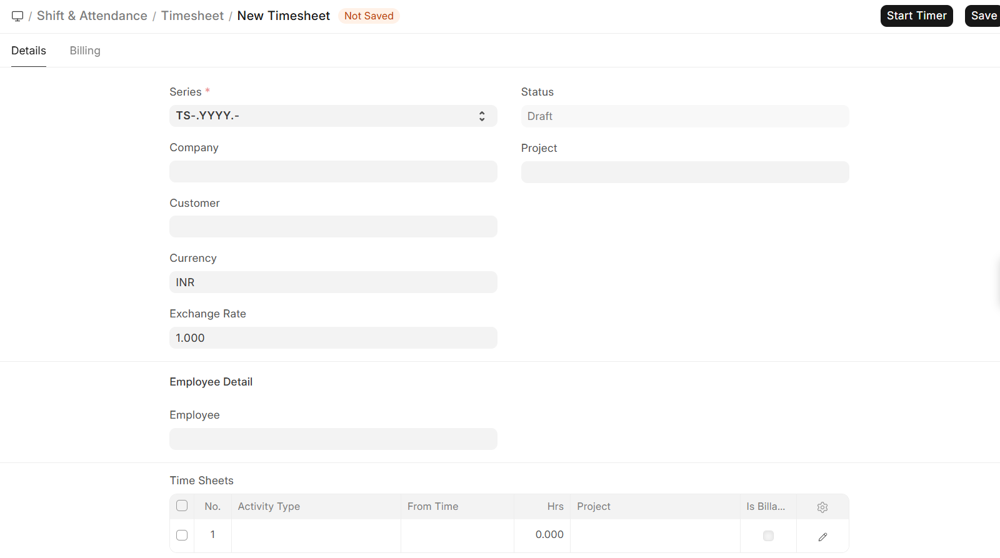

# Time Tracking

Time Tracking records the work performed by employees and the time spent on activities, supporting payroll and billing processes.

## Navigation
>Home>HR>Shift & Attendance>Time

## Timesheet

Timesheet is used to record employee working hours against activities, projects, or tasks.

### Key Fields

| Field           | Description                                      |
|-----------------|--------------------------------------------------|
| Employee        | Employee for whom time is recorded               |
| Company         | Organization context                             |
| Project         | Project linked to the work (optional)            |
| Activity Type   | Type of work performed                           |
| From Time / Hours | Time spent on activity                         |
| Status          | Draft, Submitted, Billed, Completed              |

Used to track work hours and support payroll and billing.

## Activity Type

Activity Type defines categories of work used in timesheets and helps determine billing and costing.

>Submitted Timesheets are used for payroll and billing calculations  
