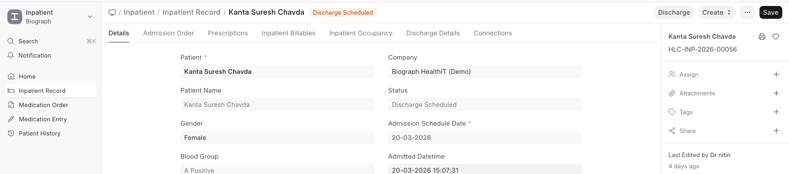

# Discharge Planning

Discharge planning begins during the admission and is finalized when the patient is ready to leave.

## Steps to Discharge

1. Ensure all **pending clinical tasks** are completed (lab results received, procedures done)
2. Ensure all **billing items** are captured:
   - Bed charges (auto-generated daily from occupancy)
   - Medication charges
   - Procedure charges
   - Lab test charges
3. Prepare the **Discharge Summary**
4. Click **Schedule Discharge** on the Inpatient Record
5. Once everything is clear, click **Discharge** to complete

> **Note:** If "Allow Discharge Despite Unbilled Items" is disabled in Healthcare Settings, the system will prevent discharge until all billable items are invoiced.

