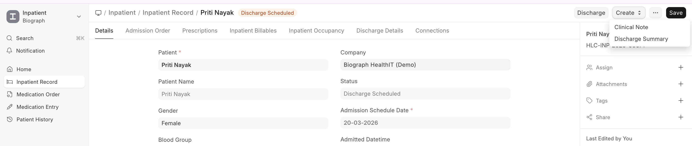
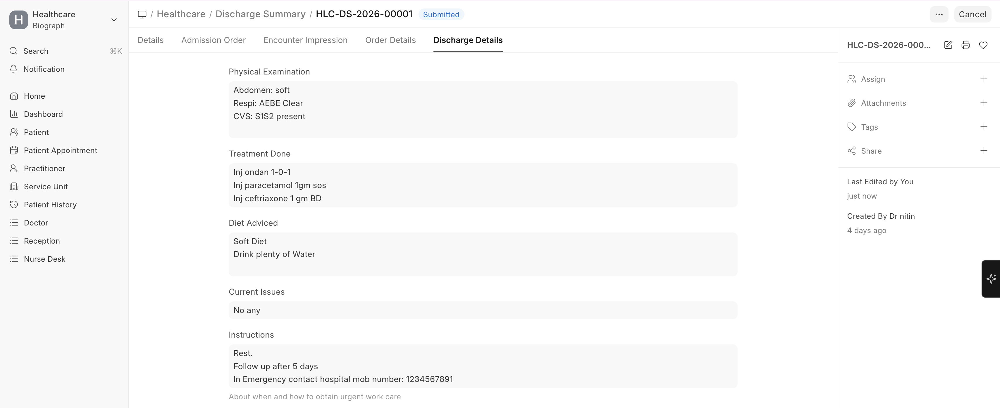

# Discharge Summary

The **Discharge Summary** is a comprehensive document provided to the patient at discharge.

## Contents

| Section | Description |
|---------|-------------|
| **Patient Information** | Name, age, gender, admission dates |
| **Admission Diagnosis** | Why the patient was admitted |
| **Treatment Summary** | What was done during the stay |
| **Medications at Discharge** | Prescriptions to continue at home |
| **Procedures Performed** | List of procedures done during admission |
| **Lab Results** | Key investigation results |
| **Follow-up Instructions** | When to return, warning signs to watch for |
| **Diet & Activity** | Dietary restrictions and activity recommendations |
| **Practitioner Details** | Attending doctor information |

To create a Discharge Summary:
>Inpatient Record → Create → Discharge Summary

## Creating a Discharge Summary

1. From the **Inpatient Record**, click **Create > Discharge Summary**
2. The system pre-fills information from:
   - The admission record
   - Encounters during the stay
   - Lab tests and procedures performed
3. The practitioner reviews and adds:
   - Summary narrative
   - Discharge medications
   - Follow-up instructions
4. Submit and print for the patient

 
