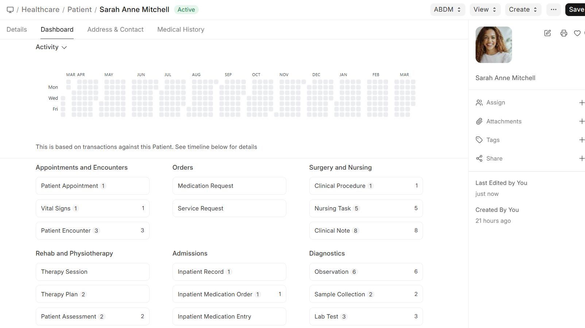

# Patient Dashboard

The Patient record serves as a **central dashboard** providing a 360-degree view:

- **Upcoming Appointments** — Next scheduled visits
- **Recent Encounters** — Latest consultation summaries
- **Active Prescriptions** — Current medications
- **Pending Lab Tests** — Tests ordered but not yet completed
- **Billing Summary** — Outstanding invoices and payment status
- **Patient Timeline** — Chronological view of all medical records

  

> The Patient History page provides a dedicated, scrollable timeline of all clinical documents linked to the patient, configurable via **Patient History Settings**.
