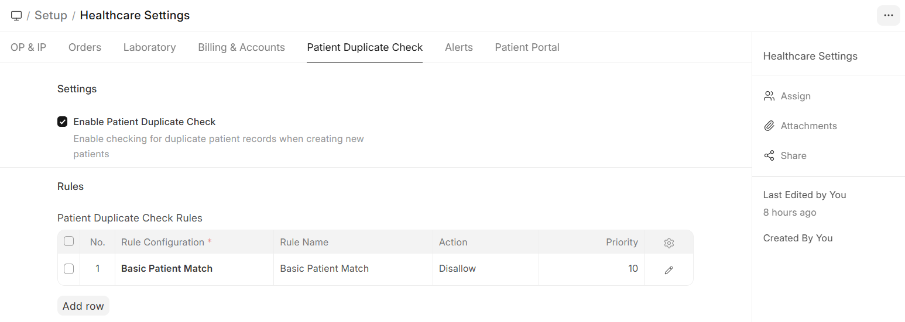

# Duplicate Patient Checking

Biograph includes a built-in **duplicate detection system** to prevent creating multiple records for the same patient.

Navigate to:

>Home>Healthcare > Setup > Healthcare Settings>Patient Duplicate Check

## How It Works

1. When a new patient is being created, the system checks for potential duplicates
2. Matching is based on configurable rules (name similarity, date of birth, phone number, etc.)
3. If potential duplicates are found, the user is warned before saving
4. The user can choose to proceed (if it's a different person) or open the existing record

## Configuration

Navigate to **Patient Duplicate Check Rule Configuration** to set up matching rules:

| Setting | Description |
|---------|-------------|
| **Check Fields** | Which fields to compare (Name, DOB, Phone, Email, etc.) |
| **Field Links** | Which patient fields to use for comparison |
| **Match Threshold** | How similar records must be to trigger a warning |

