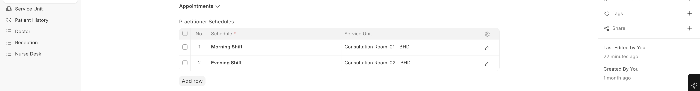
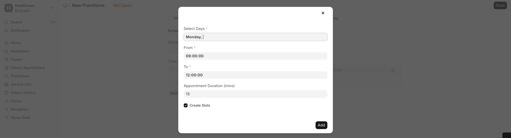
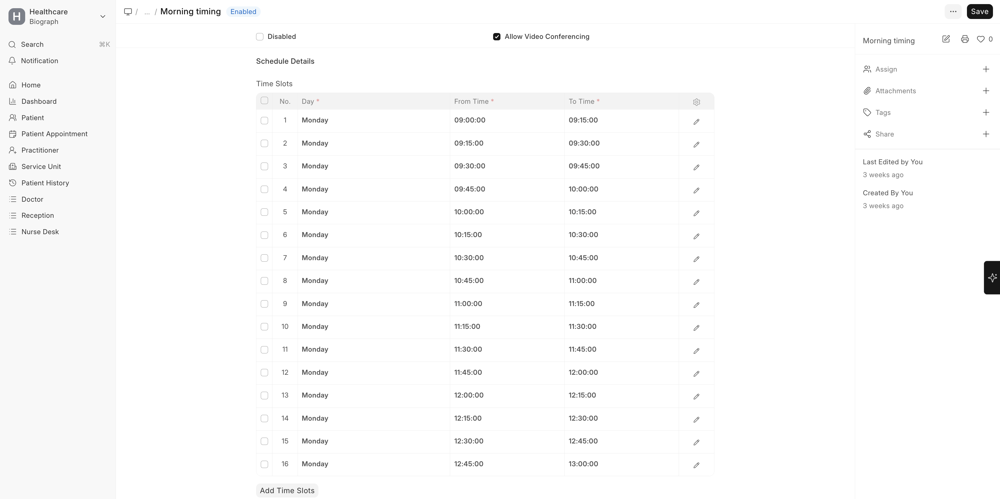

# Practitioner Availability & Schedule

## Practitioner Availability

Practitioner Availability controls **when a practitioner is available for appointments**.

### Setting Up Availability

1. Go to the **Practitioner Availability** list
2. Click **+ Add Practitioner Availability**
3. Configure:

| Field | Description |
|-------|-------------|
| **Practitioner** | Select the practitioner |
| **Service Unit** | Where they will be available (e.g., OPD Room 3) |
| **Date** | Specific date of availability |
| **From Time / To Time** | Available hours |
| **Availability** | Available or Not Available |

### Key Behaviors

- Availability records determine which **time slots** appear during appointment booking
- If no availability is set, the practitioner's **schedule template** is used as fallback
- **Unavailable** entries block specific dates (e.g., leave days, conferences)

---

## Practitioner Schedule

A **Practitioner Schedule** is a recurring weekly template that defines the practitioner's standard working hours.

### Creating a Schedule

1. Go to **Practitioner Schedule** list
2. Click **+ Add Practitioner Schedule**
3. Define time slots for each working day:

| Field | Description |
|-------|-------------|
| **Schedule Name** | e.g., "Dr. Smith – Morning Schedule" |
| **Time Slots** | List of day + from time + to time entries |

**Example Schedule:**

| Day | From | To |
|-----|------|----|
| Monday | 09:00 | 13:00 |
| Monday | 14:00 | 17:00 |
| Tuesday | 09:00 | 13:00 |
| Wednesday | 09:00 | 13:00 |
| Thursday | 09:00 | 13:00 |
| Friday | 09:00 | 12:00 |

### Practitioner Service Unit Schedule

You can assign practitioners to specific service units on specific days:

| Field | Description |
|-------|-------------|
| **Practitioner** | The practitioner |
| **Schedule** | The schedule template to follow |
| **Service Unit** | Which room/unit they will work from |

> **Tip:** A practitioner can have multiple schedules — for example, mornings at one clinic and afternoons at another.
