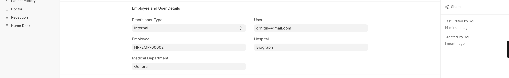
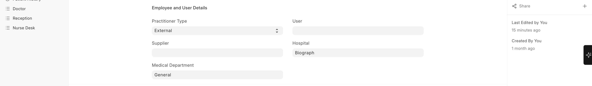

# Practitioner Types

Biograph supports two types of practitioners:

| Type | Description | Use Case |
|------|-------------|----------|
| **Internal** | Staff practitioners employed by your facility | Regular doctors, nurses, and therapists on your team |
| **External** | Visiting or referring practitioners | Guest consultants, referring doctors from other facilities |

External practitioners can be referenced in:
- **Referral tracking** — Who referred the patient
- **Consultation records** — When an external specialist is consulted
- **Billing** — Referral fee management
