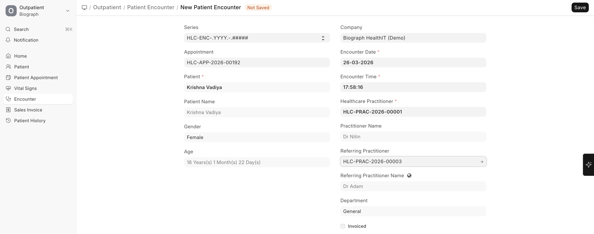

# Referring Physician Management

Track external physicians who refer patients to your facility:

1. Create the referring physician as an **External Healthcare Practitioner**
2. When booking appointments or creating encounters, select the **Referring Practitioner**
3. This information flows through to:
   - **Patient Encounter** records
   - **Sales Invoices** (for referral tracking)
   - **Reports** for referral analytics

> **Business benefit:** Tracking referral sources helps you understand which physicians or facilities are sending patients to you, enabling better relationship management and marketing decisions.

