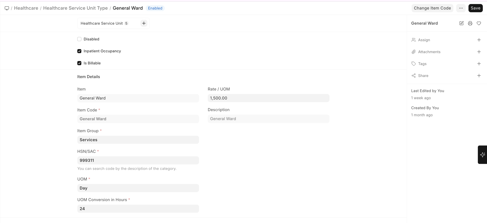
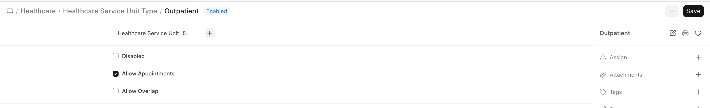

# Facility Setup

## Clinic Setup

For a single clinic or outpatient facility:

1. Create the **Company** in ERPNext (if not already done)
2. Create a root **Healthcare Service Unit** for your clinic
3. Add child service units for each consultation room
4. Set up **Medical Departments** relevant to your practice
5. Configure **Healthcare Settings** with your company and default values

## Inpatient Facility Setup

For hospitals with inpatient capabilities:

1. Create **Healthcare Service Unit Types** for:
   - General Ward (with **Inpatient Occupancy** enabled)
   - Private Room (with **Inpatient Occupancy** enabled)
   - ICU (with **Inpatient Occupancy** enabled)
2. Create the ward structure as a service unit tree
3. Enable inpatient-related settings in Healthcare Settings

## Bed & Occupancy Setup

1. Create a **Healthcare Service Unit Type** with **Inpatient Occupancy** checked
2. Create individual bed units under ward service units
3. Each bed is a leaf-level service unit marked as **Occupiable**
4. The system automatically tracks bed availability and occupancy status

## Laboratory Setup

1. Create a **Healthcare Service Unit** for your laboratory
2. Create **Lab Test Templates** for each test your lab performs
3. Configure **Lab Test Samples** (Blood, Urine, Sputum, etc.)
4. Set up **Observation Templates** with reference ranges
5. Define normal/abnormal value ranges for automated flagging

### Lab Test Templates

To create a Lab Test Template:

Home → Healthcare → Setup → Lab Test Template → New

### Lab Test Sample

To create a Lab Test Sample:

Home → Healthcare → Setup → Lab Test Sample → New

### Lab Test UOM

To create a Lab Test UOM:

Home → Healthcare → Setup → Lab Test UOM → New

## Pharmacy Setup

Biograph uses ERPNext's **Stock module** for pharmacy management:

1. Create a **Warehouse** for your pharmacy in ERPNext
2. Set up **Items** for each medication with stock tracking enabled
3. Create **Medication** records linking to ERPNext Items
4. Configure **Dosage Forms** and **Prescription Dosages**
