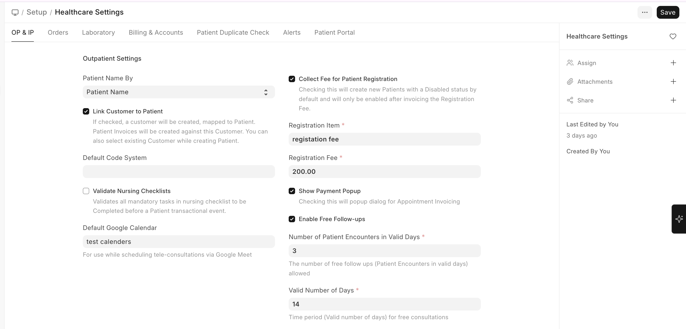
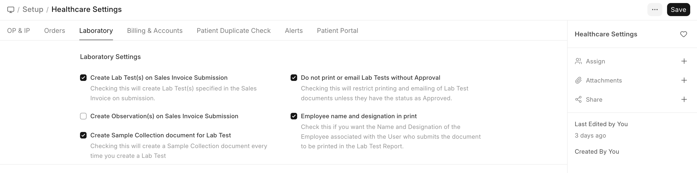
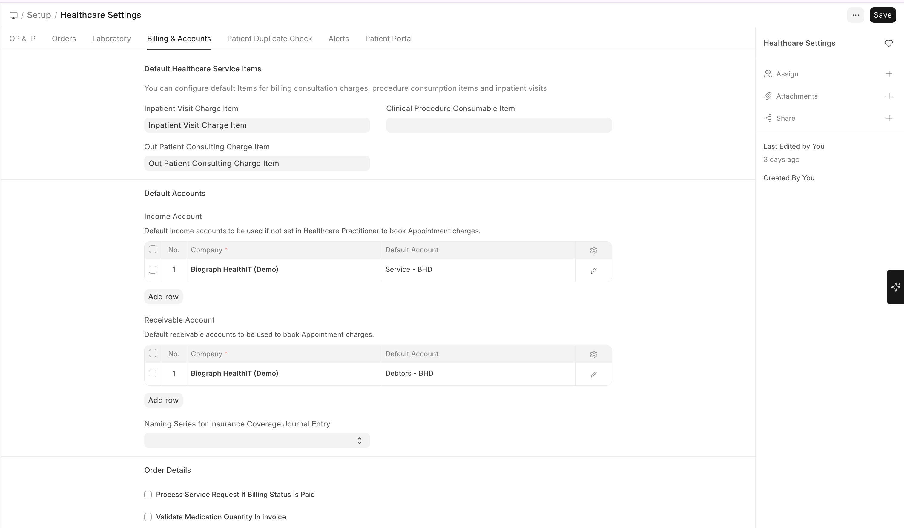
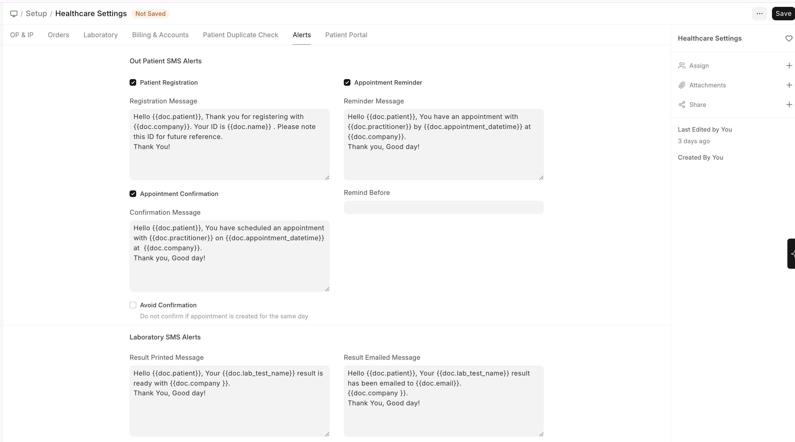
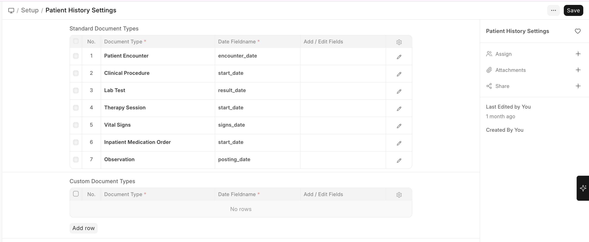

# Initial Healthcare Configuration

To configure Healthcare Settings:

>Home → Healthcare → Settings → Healthcare Settings

Navigate to **Healthcare Settings** from the search bar or via **Setup workspace > Healthcare Settings**.

## Healthcare Settings (General)

| Setting | Description |
|---------|-------------|
| **Company** | Select the company entity for your healthcare facility |
| **Default Medical Code Standard** | Choose the medical coding system (ICD-10, SNOMED CT, etc.) |
| **Enable Free Follow-ups** | Allow free follow-up visits within a validity period |
| **Automate Appointment Invoicing** | Automatically create invoices when appointments are booked |
| **Link Customer to Patient** | Automatically create an ERPNext Customer for each Patient |
| **Collect Registration Fee** | Charge a registration fee during patient creation |
| **Registration Fee Amount** | Set the registration fee amount |
| **Manage Appointment Invoice Automatically** | Auto-generate invoices on appointment creation |

## Outpatient Settings

| Setting | Description |
|---------|-------------|
| **Default Appointment Duration** | Standard consultation time (in minutes) |
| **Appointment Reminder** | Enable automated appointment reminders |
| **Send Registration Message** | Notify patients on registration via SMS/email |
| **Patient Encounter Required Fields** | Configure mandatory fields for consultations |

## Inpatient Settings

| Setting | Description |
|---------|-------------|
| **Allow Discharge Despite Unbilled Items** | Whether to permit discharge with pending bills |
| **Auto Create Inpatient Medication Order** | Automatically create medication orders from prescriptions |

## Laboratory Settings

| Setting | Description |
|---------|-------------|
| **Create Lab Test on Encounter Submit** | Auto-create lab tests when encounter is submitted |
| **Create Sample Collection on Lab Test Creation** | Auto-trigger sample collection workflow |
| **Employee Name in Lab Test Report** | Show employee name or practitioner name in reports |

## Billing & Accounts Setup

Biograph integrates with ERPNext's Accounts module for all financial operations:

| Configuration | Where to Set |
|--------------|-------------|
| **Income Account** | Healthcare Settings > Default accounts |
| **Receivable Account** | Healthcare Settings > Default accounts |
| **Service Item for Consultations** | Mapped via Item master in ERPNext |
| **Tax Templates** | Standard ERPNext tax setup applies |

## Notification / SMS Settings

| Setting | Description |
|---------|-------------|
| **Appointment Confirmation** | Send confirmation when appointment is created |
| **Appointment Reminder** | Send reminder before appointment time |
| **Registration Notification** | Notify on new patient registration |

> **Note:** SMS and email notifications require configuring the ERPNext Email/SMS settings first.

 

## Patient History Settings

To configure Patient History Settings:

>Home → Healthcare → Settings → Patient History Settings

Navigate to **Patient History Settings** to configure which documents appear in the patient's medical timeline:

- **Standard Document Types** — Enable/disable visibility of Encounters, Lab Tests, Vital Signs, Procedures, etc. in patient history
- **Custom Document Types** — Add any custom doctypes to appear in the patient timeline
- **Date field and patient link field** must be specified for custom document types

