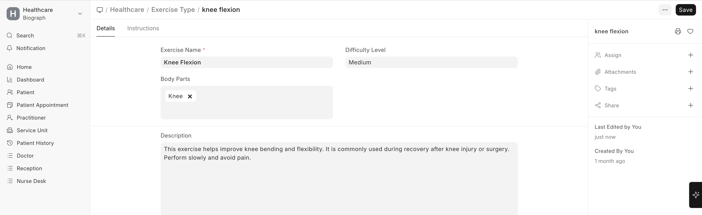
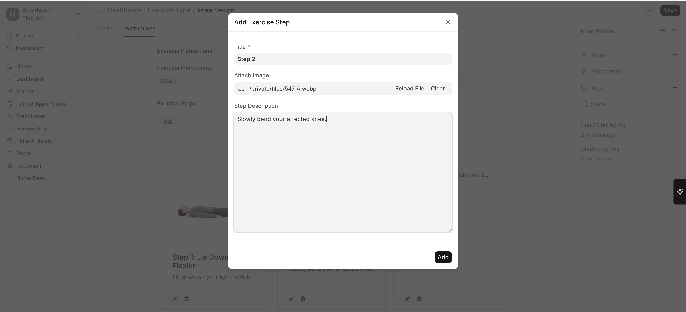

# Exercise Types

**Exercise Types** are the building blocks of therapy plans. Each exercise type defines a specific therapeutic activity.

To create an Exercise Type:

>Home → Healthcare → Rehabilitation and Physiotherapy → Exercise Type → New

## Creating an Exercise Type

1. Go to **Exercise Type** list
2. Click **+ Add Exercise Type**
3. Configure:

| Field | Description |
|-------|-------------|
| **Exercise Name** | Descriptive name (e.g., "Knee Flexion Stretch", "Shoulder Rotation") |
| **Body Part** | Target area (Knee, Shoulder, Back, etc.) |
| **Difficulty Level** | Easy, Medium, Hard, Expert |
| **Description** | Detailed instructions for performing the exercise |
| **Steps** | Step-by-step breakdown of the exercise |

## Difficulty Levels
q
Pre-configured difficulty levels help therapists choose appropriate exercises:

| Level | Typical Use |
|-------|-------------|
| **Easy** | Initial recovery, elderly patients, post-surgery day 1-3 |
| **Medium** | Mid-recovery, building strength |
| **Hard** | Advanced recovery, near-full function restoration |
| **Expert** | Sports rehabilitation, maximum performance recovery |

