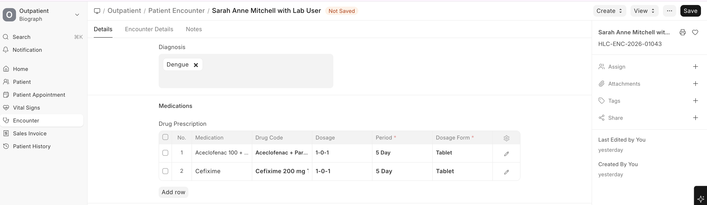

# Prescription Processing

The prescription workflow connects the doctor's orders to the pharmacy.

## Prescription Flow

```
Practitioner orders medication
(in Patient Encounter)
        |
        v
Drug Prescription created
        |
        v
Medication Request generated
        |
        v
Pharmacy receives the request
        |
        v
Pharmacist verifies and dispenses
        |
        v
Stock updated (ERPNext Stock)
        |
        v
Patient receives medication
```




## Drug Prescription Details

When a practitioner prescribes medication in an encounter, each prescription entry includes:

| Field | Description |
|-------|-------------|
| **Drug / Medication** | The medication being prescribed |
| **Dosage** | Amount per dose (e.g., 1-0-1 means morning-afternoon-night) |
| **Period** | Duration (3 Days, 1 Week, 1 Month, etc.) |
| **Dosage Form** | Tablet, Capsule, Syrup, etc. |
| **Interval** | How often (Every Day, Twice Daily, etc.) |
| **Route** | Oral, IV, IM, Topical, etc. |
| **Instructions** | Before food, After food, At bedtime, etc. |
| **Quantity** | Total quantity to dispense |
