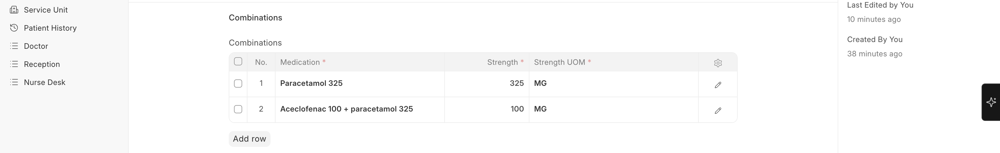
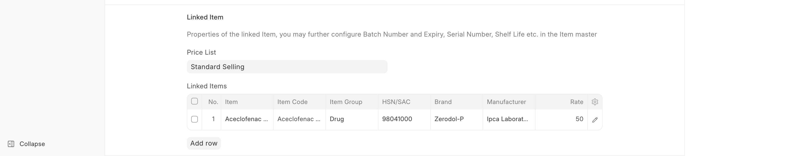

# Stock Integration

Biograph leverages ERPNext's **Stock (Inventory) module** for pharmacy stock management.

## How It Works

| ERPNext Module | Healthcare Use |
|---------------|---------------|
| **Item** | Each medication has a corresponding ERPNext Item |
| **Warehouse** | Your pharmacy is set up as a Warehouse |
| **Stock Entry** | Record stock receipts when medications arrive |
| **Stock Ledger** | Real-time stock levels for each medication |
| **Reorder Level** | Auto-notify when stock is running low |
| **Batch Tracking** | Track medication batches and expiry dates |

## Pharmacy Operations

- **Stock receipts** — Record incoming medication stock via ERPNext Purchase Receipt
- **Dispensing** — When medications are dispensed, stock is deducted via Delivery Note or Stock Entry
- **Stock reports** — View current levels, expiring stock, reorder requirements
- **Multi-location** — Manage stock across multiple pharmacy locations or ward pharmacies

---

## Combination Drugs

For medications that combine multiple active ingredients (e.g., Amoxicillin + Clavulanic Acid):

1. Create a single **Medication** entry for the combination
2. List all **ingredients** with their individual quantities
3. The combination appears as a single selectable option during prescribing

   
   

### Managing Linked Medications

Use **Medication Linked Items** to connect related medications:
- Different strengths of the same drug (e.g., Paracetamol 500mg and 650mg)
- Different dosage forms (e.g., Omeprazole Tablet and Omeprazole Capsule)
- Generic and brand alternatives

    
