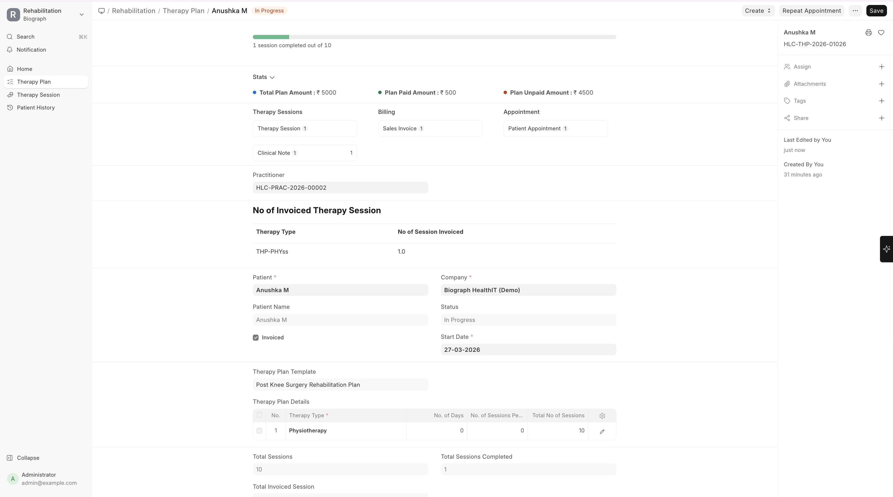
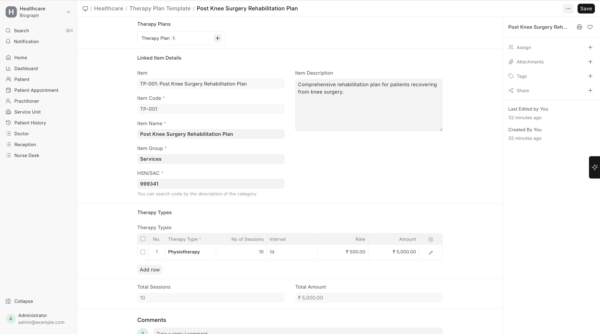

# Therapy Plans

A **Therapy Plan** is the master plan prescribed for a patient's rehabilitation journey. It brings together therapy types and exercises into a structured program.

To create a Therapy Plan:

>Home → Healthcare → Rehabilitation and Physiotherapy → Therapy Plan → New

## Creating a Therapy Plan

1. Can be ordered from a **Patient Encounter** (therapy prescription)
2. Or created directly from the **Therapy Plan** list

| Field | Description |
|-------|-------------|
| **Patient** | The patient receiving therapy |
| **Practitioner** | The prescribing or supervising practitioner |
| **Start Date** | When therapy begins |
| **Plan Details** | List of therapies with number of sessions |

## Plan Details

Each entry in the therapy plan specifies:

| Field | Description |
|-------|-------------|
| **Therapy Type** | Which therapy |
| **Number of Sessions** | Total sessions prescribed |
| **Sessions Completed** | Auto-tracked as sessions are logged |

---

## Therapy Plan Templates

**Therapy Plan Templates** are reusable blueprints for common rehabilitation programs. Instead of building a plan from scratch each time, use a template.

### Creating a Template

| Field | Description |
|-------|-------------|
| **Template Name** | e.g., "Post Knee Replacement - Standard", "Frozen Shoulder Protocol" |
| **Template Details** | List of therapy types and session counts |

**Example: Post Knee Replacement Template**

| Therapy | Sessions |
|---------|----------|
| Physiotherapy - Range of Motion | 15 |
| Physiotherapy - Strengthening | 20 |
| Physiotherapy - Gait Training | 10 |

> **Tip:** Templates can be applied to a new therapy plan, pre-populating all the therapy types and session counts. The practitioner can then adjust as needed for the specific patient.
