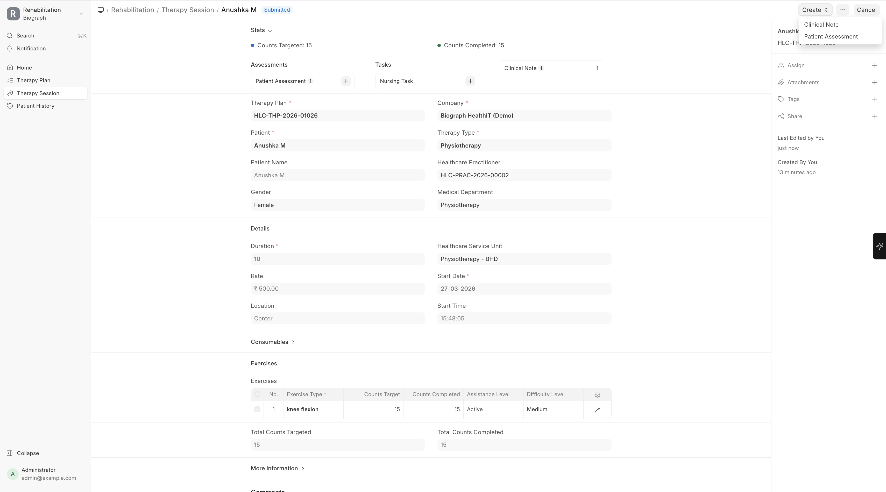

# Therapy Sessions

A **Therapy Session** records an individual therapy appointment or session.

To create a Therapy Session:

>Home → Healthcare → Rehabilitation and Physiotherapy → Therapy Session → New  
 (or create from Therapy Plan → Create → Therapy Session)

## Creating a Therapy Session

| Field | Description |
|-------|-------------|
| **Patient** | The patient |
| **Therapy Plan** | Link to the patient's therapy plan |
| **Therapy Type** | Which type of therapy for this session |
| **Practitioner** | The therapist conducting the session |
| **Service Unit** | Where the session takes place |
| **Start Date/Time** | Session timing |
| **Duration** | Actual session length |
| **Exercises** | Exercises performed during the session |

## Session Documentation

During and after each session, the therapist records:

- **Exercises performed** — Which exercises, sets, reps, and duration
- **Patient response** — How the patient tolerated the session
- **Progress notes** — Improvements or concerns observed
- **Next session goals** — What to focus on next time

## Tracking Progress

The system tracks:
- **Sessions completed vs. planned** — Progress against the therapy plan
- **Attendance** — Which sessions were attended, missed, or rescheduled
- **Outcome metrics** — Based on assessment scores over time
