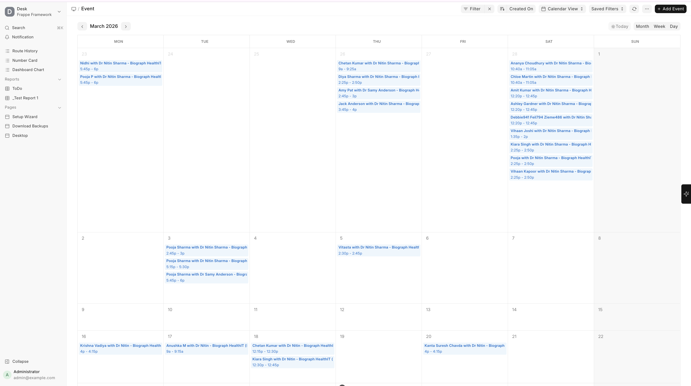

# Appointment Calendar

The **Appointment Calendar** provides a visual overview of all scheduled appointments:

- **Day/Week/Month views** — Switch between views for different planning needs
- **Color coding** — Appointments are color-coded by appointment type
- **Click to create** — Click on an empty time slot to quickly create a new appointment
- **Drag to reschedule** — Move appointments by dragging (if permissions allow)
- **Filter by practitioner** — View appointments for a specific doctor
- **Filter by department** — View all appointments in a department

  
