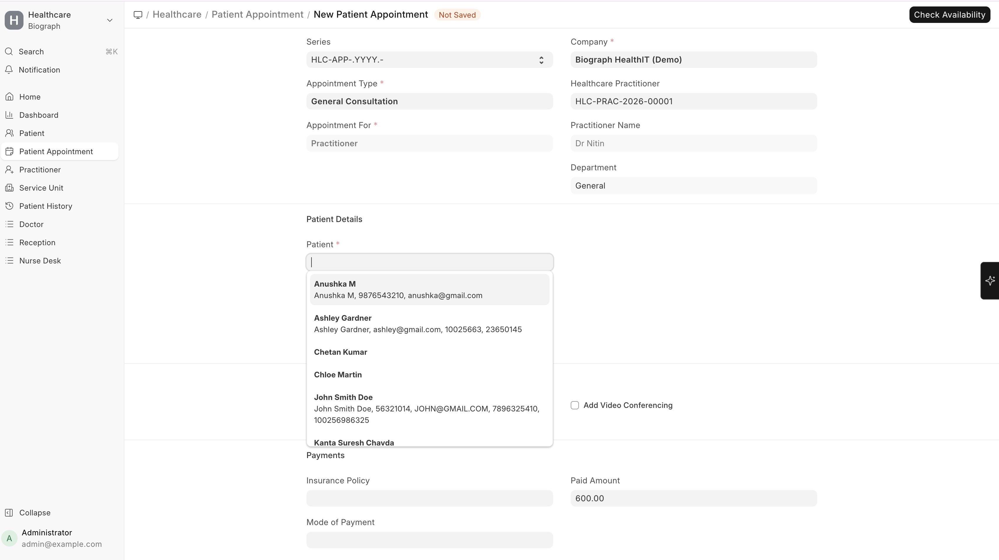

# Creating a Patient Appointment

To create a Patient Appointment, go to:

**Home → Healthcare → Patient Appointment**

## From the Appointment List

1. Go to **Patient Appointment** list
2. Click **+ Add Patient Appointment**
3. Fill in the details:

| Field | Description |
|-------|-------------|
| **Patient** | Select the patient (auto-populates patient name) |
| **Appointment Type** | Choose the type (General, Follow-up, Specialist, etc.) |
| **Practitioner** | Select the doctor/practitioner |
| **Department** | Medical department (auto-filled from practitioner) |
| **Service Unit** | Specific room or location (optional) |
| **Appointment Date** | Select the date |
| **Appointment Time** | Choose from available time slots |
| **Duration** | Auto-filled from appointment type, can be overridden |
| **Referring Practitioner** | If the patient was referred by another doctor |
| **Notes** | Any additional notes for the appointment |

## Available Time Slots

When you select a practitioner and date, the system shows **available time slots** based on:
1. The practitioner's **schedule template** for that day of the week
2. Any **availability overrides** for that specific date
3. Time slots already booked by other patients are excluded
4. Buffer time between appointments (if configured)
