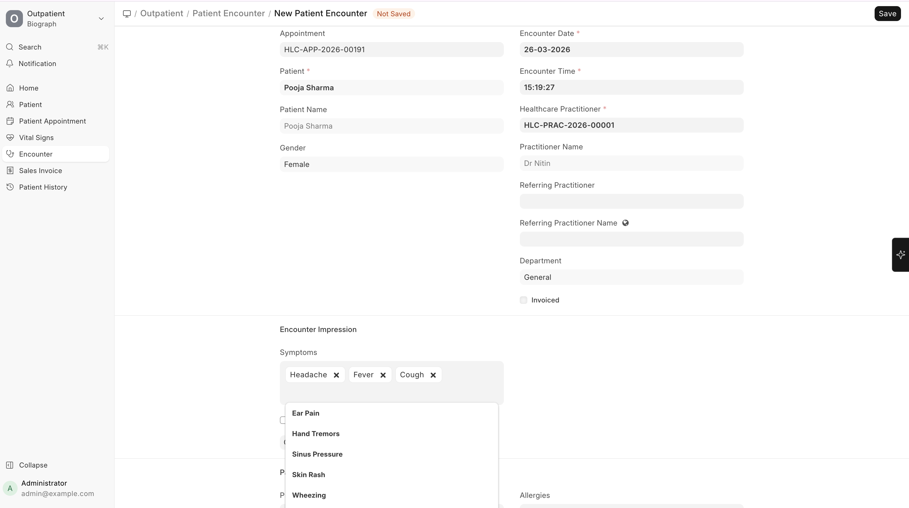
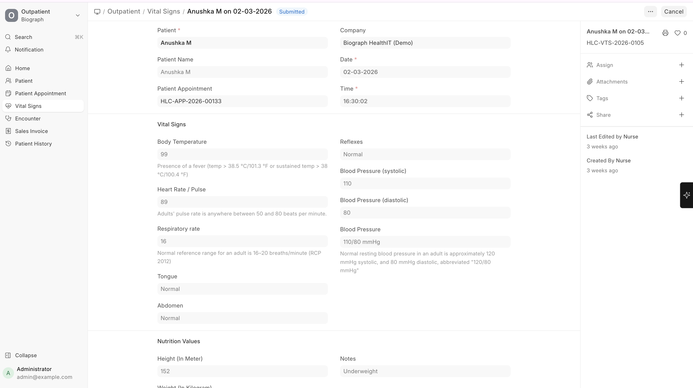

# Clinical Documentation

## Complaints (Symptoms)

Record what the patient reports:

| Field | Description |
|-------|-------------|
| **Complaint** | Select from master list or type a new one (e.g., Fever, Headache, Cough) |
| **Duration** | How long the patient has had the symptom |
| **Severity** | Mild, Moderate, Severe |
| **Notes** | Additional details about the complaint |

> **Tip:** Frequently used complaints can be pre-configured in the **Complaint** master for quick selection via dropdown.

## Diagnosis

Record the practitioner's clinical assessment:

| Field | Description |
|-------|-------------|
| **Diagnosis** | Select or enter the diagnosis |
| **Medical Code** | Linked ICD-10 or SNOMED code (for standardized reporting) |
| **Description** | Additional notes about the diagnosis |

Multiple diagnoses can be recorded per encounter (primary and secondary).

## Vital Signs

Vital signs can be recorded directly within the encounter or via a separate **Vital Signs** record:

| Vital | Unit |
|-------|------|
| **Temperature** | °F or °C |
| **Pulse / Heart Rate** | bpm |
| **Respiratory Rate** | breaths/min |
| **Blood Pressure** | mmHg (systolic/diastolic) |
| **SpO2** | % |
| **Height** | cm |
| **Weight** | kg |
| **BMI** | Auto-calculated from height and weight |
| **Nutrition Notes** | Dietary observations |

## Clinical Notes

Free-text areas for comprehensive documentation:

- **Examination details** — Physical examination findings
- **Clinical notes** — Practitioner's observations and assessment
- **Doctor Advice** — Instructions given to the patient

> **Doctor Advice Templates** can be pre-configured for frequently given advice (e.g., "Rest for 3 days", "Avoid spicy food", "Return if symptoms worsen").
