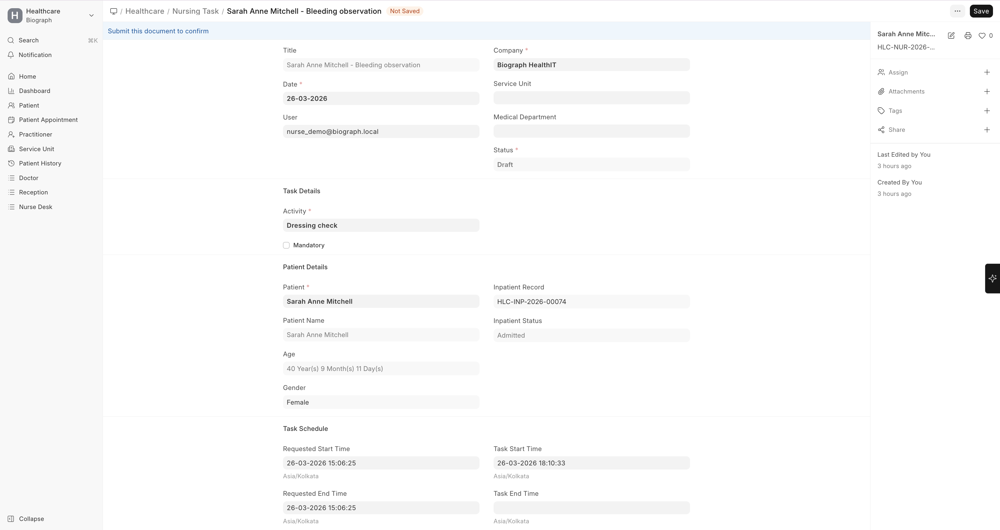

# Nursing Tasks

**Nursing Tasks** are actionable items assigned to nursing staff for patient care activities. They ensure that all ordered care activities are tracked, completed, and documented.

## What Triggers Nursing Tasks

Nursing tasks can be generated from:
- **Medication orders** — Administer prescribed medications
- **Procedure orders** — Prepare patients for procedures
- **Vital sign monitoring** — Scheduled vital sign checks
- **Doctor instructions** — Any task assigned by the physician
- **Manual creation** — Nurses can create tasks directly

## Task Details

| Field | Description |
|-------|-------------|
| **Task Name** | Description of the nursing task |
| **Patient** | The patient this task is for |
| **Assigned To** | The nurse or nursing team assigned |
| **Due Date/Time** | When the task needs to be completed |
| **Priority** | Urgent, High, Medium, Low |
| **Status** | Draft, Open, Completed, Cancelled |
| **Notes** | Additional instructions or observations |

## Managing Tasks

Nurses can:
1. View their assigned tasks from the **Nursing Task** list
2. Filter tasks by status, priority, or patient
3. Mark tasks as **Completed** when done
4. Add completion notes and observations
5. Flag tasks that need physician attention

## Task Validation

Nursing tasks include validation controls to ensure care quality:

- **Mandatory tasks** must be completed before proceeding to the next step
- **Time-stamped completion** records exactly when each task was done
- **User tracking** shows which nurse completed each task
- **Sequence enforcement** ensures tasks are done in the correct order (when configured)
- **Supervisor sign-off** can be required for critical tasks
