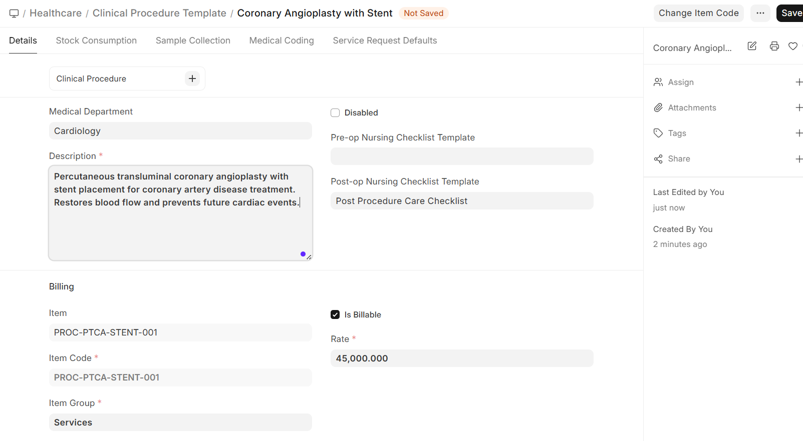
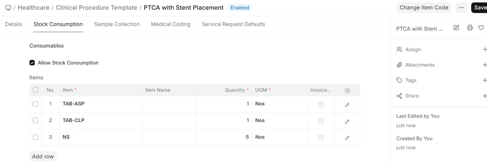

# Procedure Templates

**Clinical Procedure Templates** define reusable configurations for commonly performed procedures. Setting up templates saves time and ensures consistency.

Navigation:

>Home>Healthcare>Consultation Setup>Clinical Procedure Template

## Template Configuration

| Field | Description |
|-------|-------------|
| **Template Name** | Descriptive name (e.g., "ECG - 12 Lead", "Wound Dressing - Minor") |
| **Department** | Medical department responsible |
| **Item** | ERPNext Item linked for billing |
| **Rate** | Standard charge for this procedure |
| **Description** | Detailed procedure description |
| **Medical Code** | ICD/SNOMED code for the procedure |

## Consumables

Each template can specify consumables (materials used during the procedure):

| Consumable Field | Description |
|-----------------|-------------|
| **Item** | The consumable item from ERPNext Stock |
| **Quantity** | Amount needed per procedure |
| **Item Group** | Category of the consumable |

**Examples:**

| Procedure | Consumables |
|------------|-------------|
| Wound Dressing | Gauze (2), Bandage (1), Antiseptic (1) |
| IV Cannulation | IV Cannula (1), Surgical Tape (1), Cotton Swab (2) |
| Suturing | Suture Kit (1), Local Anesthesia (1), Sterile Drape (1) |

> When a procedure is performed, the consumables can be automatically deducted from stock (when integrated with ERPNext Stock module).
