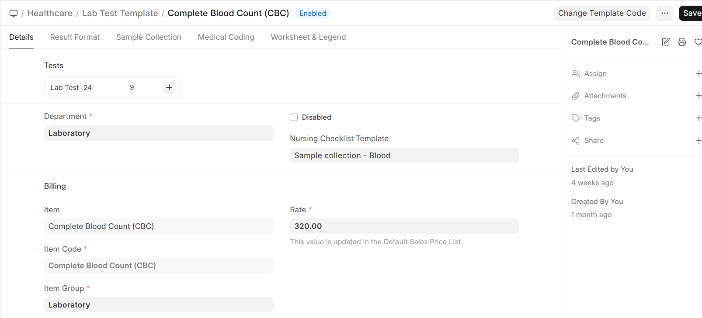
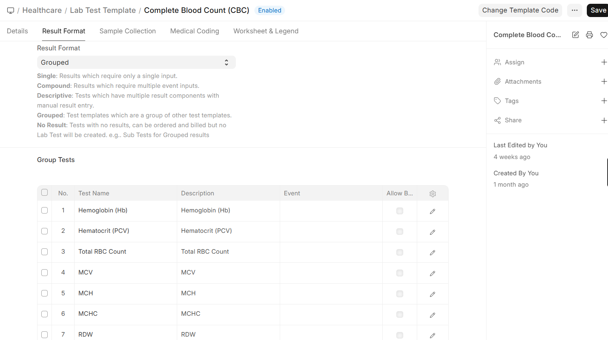

# Lab Test Templates

**Lab Test Templates** define the configuration for each type of laboratory test your facility offers. Templates must be set up before lab tests can be ordered.

Navigation:

>Home>Healthcare>Laboratory Setup>Lab Test Template

## Creating a Lab Test Template

1. Go to **Lab Test Template** list
2. Click **+ Add Lab Test Template**
3. Configure the template:

| Field | Description |
|-------|-------------|
| **Test Name** | Name of the test (e.g., Complete Blood Count, Blood Glucose, Lipid Profile) |
| **Department** | Medical department responsible |
| **Item** | ERPNext Item for billing |
| **Rate** | Standard charge for this test |
| **Lab Test Group** | Group category (Hematology, Biochemistry, Microbiology, etc.) |
| **Result Format** | Normal / Descriptive / Organism (see below) |
| **Sample Required** | Which sample type is needed (Blood, Urine, etc.) |

## Result Format Types

| Format | Use Case | Example |
|--------|----------|---------|
| **Normal** | Numeric results with reference ranges | Hemoglobin: 14.5 g/dL (Normal: 13.0-17.0) |
| **Descriptive** | Text-based results | Urine Appearance: Clear, Color: Pale Yellow |
| **Organism** | Microbiology with sensitivity testing | Culture: E. coli — Sensitive to Amoxicillin |

## Group Templates

For tests that contain multiple sub-tests (panels), use **Lab Test Group Templates**:

**Example: Complete Blood Count (CBC)**
| Sub-Test | Unit | Normal Range |
|----------|------|-------------|
| Hemoglobin | g/dL | 13.0 - 17.0 |
| WBC Count | /μL | 4,000 - 11,000 |
| Platelet Count | /μL | 150,000 - 400,000 |
| RBC Count | million/μL | 4.5 - 5.5 |
| Hematocrit | % | 38 - 50 |

