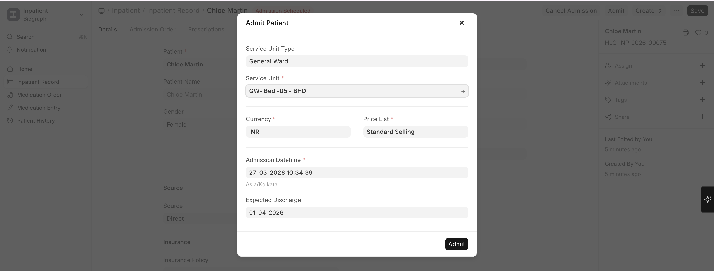

# Bed & Occupancy Management

## How Bed Management Works

- Each bed is a **Healthcare Service Unit** with **Inpatient Occupancy** enabled
- When a patient is admitted, they are assigned to an available bed
- The system tracks **Inpatient Occupancy** records with check-in and check-out times
- Real-time bed availability is visible across the facility

## Bed Assignment

1. During admission, select the **Service Unit** (bed/room) for the patient
2. The system creates an **Inpatient Occupancy** record:

| Field | Description |
|-------|-------------|
| **Service Unit** | The bed or room assigned |
| **Check In** | Date and time of bed assignment |
| **Check Out** | Date and time when the patient vacates (filled on transfer or discharge) |
| **Left** | Whether the patient has left this bed |

## Occupancy Tracking

- **Occupied beds** are automatically marked as unavailable for new admissions
- **Bed board view** (via dashboards) shows real-time occupancy status
- **Billing integration** — Occupied bed time can be automatically converted to billable items via a daily scheduled task

