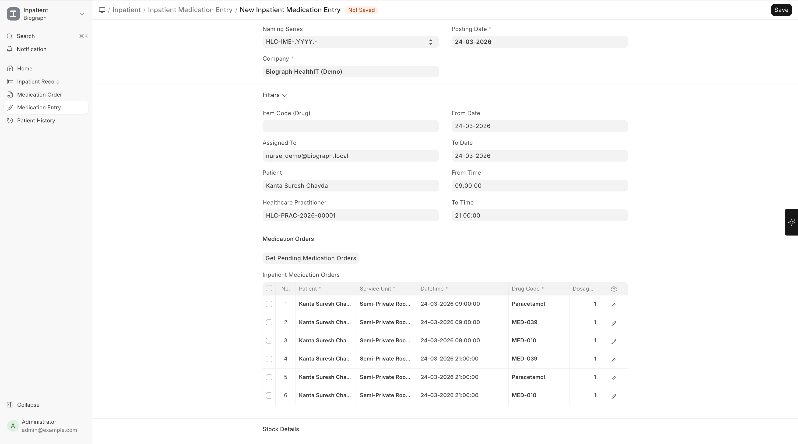

# Medication Administration

**Inpatient Medication Entry** records track the actual administration of medications to admitted patients.

## Administration Process

1. Nurse opens the pending **Inpatient Medication Entry** for the current time slot
2. Verifies:
   - Correct patient
   - Correct medication and dose
   - Correct time
   - Patient allergies
3. Administers the medication
4. Records the administration:

| Field | Description |
|-------|-------------|
| **Patient** | The patient receiving medication |
| **Medication** | What was administered |
| **Dosage** | Amount given |
| **Date/Time** | When it was administered |
| **Administered By** | Nurse name |
| **Notes** | Any observations (patient tolerance, reactions, etc.) |

5. Submits the entry

> **Important:** Inpatient Medication Entries are exempt from auto-cancellation, ensuring medication records remain intact even if related orders change.

