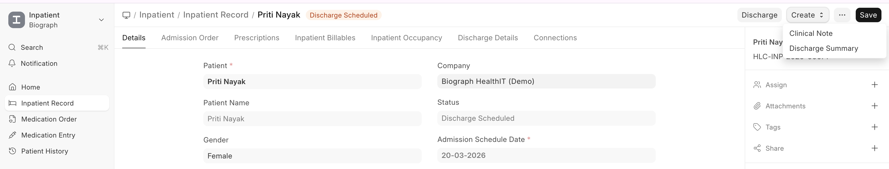
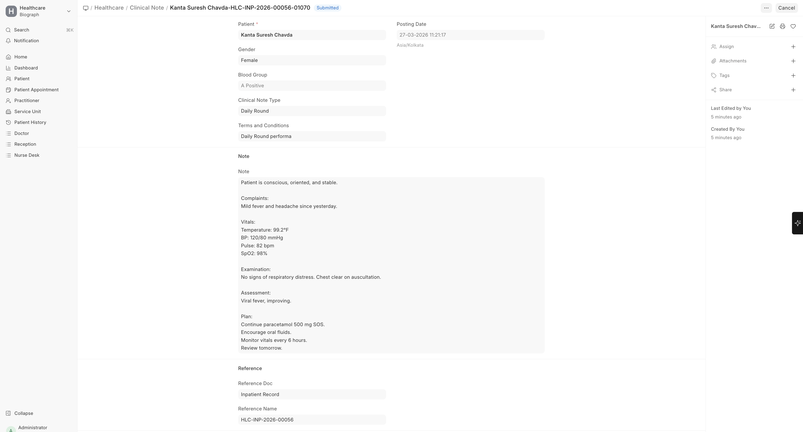

# Clinical Notes

To create Clinical Notes:

>Home → Healthcare → Clinical Note → New
 (or create from Inpatient Record → Create → Clinical Note)

During an inpatient stay, practitioners conduct regular rounds and document progress:

- **Daily clinical notes** via Patient Encounters linked to the Inpatient Record
- **Multiple encounters** per admission — each round creates a new encounter
- **Vital signs** recorded at regular intervals
- **Nursing notes** captured through nursing tasks

  

  

   

## Documentation During Admission

| Document | Purpose | Frequency |
|----------|---------|-----------|
| **Patient Encounter** | Doctor's round notes, orders | Daily or as needed |
| **Vital Signs** | Temperature, BP, pulse, etc. | Every 4-8 hours |
| **Nursing Tasks** | Care activities completed | As ordered |
| **Medication Entry** | Drugs administered | As per schedule |
