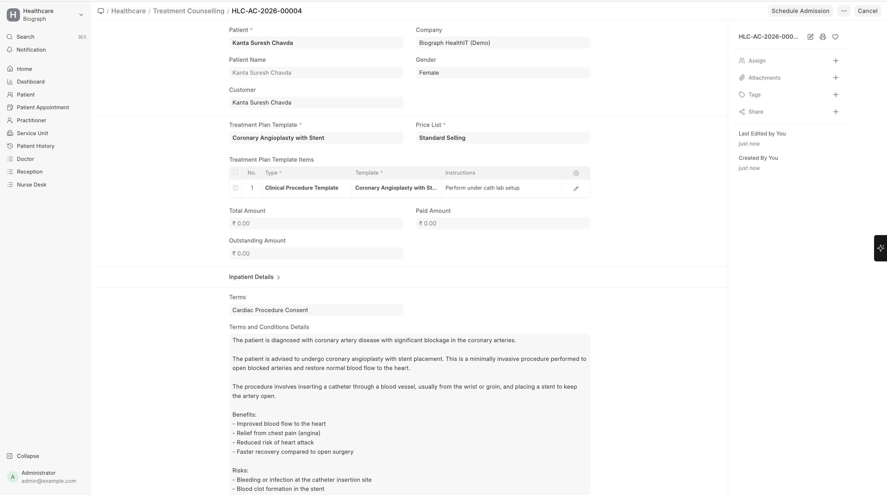

# Treatment Counselling

>Home → Healthcare → Treatment Counselling → New  
  (or Patient Encounter → Create → Treatment Counselling )

**Treatment Counselling** documents are used to explain treatment plans to patients and their families:

| Field | Description |
|-------|-------------|
| **Patient** | The patient |
| **Practitioner** | The counselling practitioner |
| **Encounter Reference** | Linked to the relevant encounter |
| **Plan Description** | Detailed treatment plan explanation |
| **Risks and Benefits** | Information shared about the treatment |
| **Patient Consent** | Record of patient's informed consent |

