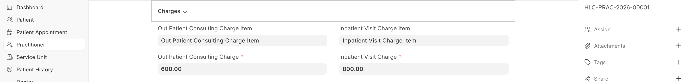

# Practitioner Charges

Consultation charges are configured directly on the Healthcare Practitioner record:

| Charge Type | Description |
|-------------|-------------|
| **OP Consulting Charge** | Fee for outpatient consultations |
| **Inpatient Visit Charge** | Fee for each inpatient round/visit |
| **Charge Item** | The ERPNext Item linked for billing |

Charges can vary based on:
- **Appointment Type** — Different fees for first visit vs. follow-up
- **Service Unit** — Different fees at different locations
- **Insurance vs. Self-Pay** — Different rate structures

## Fee Validity

Biograph supports **fee validity periods** to allow free follow-up consultations:

- When a patient pays for a consultation, a **Fee Validity** record is created
- Within the validity period (configurable number of days), the patient can have follow-up visits without being charged again
- Once the validity expires, the next consultation generates a new invoice
- Validity status is automatically updated daily by the system
