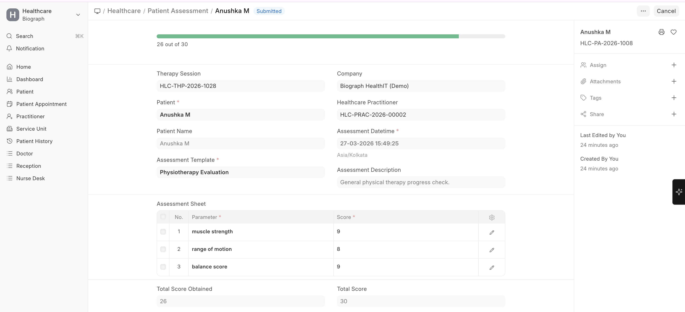

# Patient Assessments

**Patient Assessments** are structured evaluations used to measure a patient's functional status and track rehabilitation progress over time.

To create a Patient Assessment:

>Home → Healthcare → Rehabilitation and Physiotherapy → Patient Assessment → New  
 (or create from Therapy Session)

## Assessment Components

| Component | Description |
|-----------|-------------|
| **Assessment Template** | Pre-configured assessment form (e.g., Barthel Index, VAS Pain Scale) |
| **Assessment Parameters** | Individual measurement items within the template |
| **Score / Value** | Measured values for each parameter |
| **Assessment Sheet** | The completed assessment with all scores |

## How Assessments Work

1. Select or create an **Assessment Template** with relevant parameters
2. At the start of therapy, perform a **baseline assessment**
3. At regular intervals during therapy, perform **follow-up assessments**
4. Compare scores over time to measure **improvement or decline**

## Common Assessment Types

| Assessment | Purpose | Used For |
|------------|---------|----------|
| **VAS Pain Scale** | Rate pain intensity (0-10) | Any pain-related condition |
| **Range of Motion** | Measure joint flexibility | Orthopedic rehabilitation |
| **Muscle Strength** | Grade muscle power (0-5) | Post-surgery, neurological rehab |
| **Barthel Index** | Activities of daily living independence | Stroke, elderly care |
| **Berg Balance Scale** | Balance and fall risk | Elderly, neurological conditions |

> **Reports:** Use the **Planned vs Actual Therapy Session** report to compare prescribed therapy sessions against actual attendance and completion rates.

